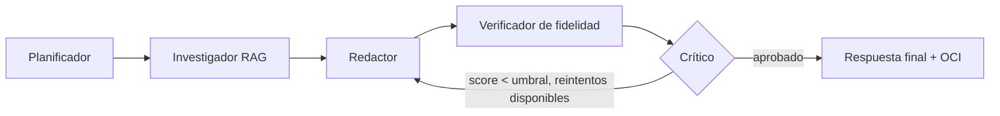

# NuevaMente 🎓 — Kairos G10

Sistema Inteligente de Adaptación y Generación de Contenido Educativo.
**Hackathon ONE G10** (Oracle Next Education & Alura) — Proyecto 1.
Equipo **Kairos G10** (G10-LATAM-equipo 41) · Nicho de foco: **Salud**.

> ⚕️ El contenido que genera esta aplicación es material de apoyo educativo
> basado en la documentación que el usuario proporciona. **No reemplaza el
> criterio de un profesional de salud ni las indicaciones oficiales vigentes.**

---

## 1. Qué hace

Recibe un documento técnico (PDF, Markdown o texto), lo indexa con RAG, y lo
transforma en contenido educativo personalizado según:

- **Perfil del destinatario:** Principiante, Desarrollador Junior/Semi Senior,
  Líder Técnico/Arquitecto, Gestor/Ejecutivo.
- **Formato pedagógico:** Flashcards, Quiz, Tutorial, Resumen Ejecutivo, Guion
  de Clase, Podcast (solo en audio).
- **Nicho/sector:** General, Fintech, Salud, E-commerce.

Cualquier resultado se puede descargar como **documento Word (.docx)** o
**presentación PowerPoint (.pptx)**, además de Markdown y CSV para Anki (botones
"📝 Word" y "📊 PowerPoint" en la interfaz, o
`GET /api/v1/contenidos/{objeto_id}/exportar?formato=docx|pptx&titulo=...`). Cada formato
tiene su propio diseño: tarjetas pregunta/respuesta, cada pregunta del quiz seguida
de su respuesta, un paso por diapositiva, puntos clave, y las escenas del guion con
la narración en las **notas del orador**.

El **Guion de Clase** además se puede convertir en un **video MP4 narrado**: una
diapositiva por escena con la narración en voz en off (botón "Generar video" en
la interfaz, o `GET /api/v1/contenidos/{objeto_id}/video`).

El **Podcast** es una conversación entre dos locutores: Ana conduce y pregunta,
y Leo explica lo que dice el documento. Se entrega **solo como audio MP3**, con
una voz distinta para cada uno: la interfaz lo graba al terminar y muestra el
reproductor (o `GET /api/v1/contenidos/{objeto_id}/podcast`). No se exporta a
Markdown, Anki ni PowerPoint. Las voces son **naturales, de Gemini TTS** (Ana: *Sulafat*,
cálida; Leo: *Charon*, clara), con tono pausado y claro; se configuran con
`PODCAST_VOCES`, `PODCAST_VOZ_ANA` y `PODCAST_VOZ_LEO`. Si Gemini TTS no está
disponible (sin cuota o sin red), el episodio se narra con las voces del sistema
y la interfaz lo indica. Solo se verifican contra la fuente
las intervenciones de Leo, que son las que llevan contenido del documento.

Cada afirmación generada se **verifica contra el documento fuente** y se le
asigna un score de anclaje. Esto vale para los 6 formatos: en Resumen Ejecutivo
se verifica cada oración del resumen, en Guion de Clase cada escena y en Podcast cada intervención de Leo. Si un
resultado no trae afirmaciones con fuente, no se aprueba y su score es 0. Todo se guarda en OCI Object Storage (o en un
respaldo local si OCI no está configurado) y se expone por API REST y por una
interfaz web (HTML/CSS/JS, servida por la misma API en `http://localhost:8000/`).

## 2. Arquitectura

```
Documento (PDF/MD/TXT)
        │
        ▼
   [Ingesta]  chunking con solapamiento + detección de secciones
        │
        ▼
[RAG local]  TF-IDF (scikit-learn) + vector store propio, aislado por doc_id
        │
        ▼
[Orquestación]  Planificador → Investigador (por sección) → Redactor →
                Verificador de fidelidad → Crítico (con reintento)
        │
        ▼
[Persistencia]  OCI Object Storage (o fallback local en data/fallback/)
        │
        ▼
  API REST (FastAPI)  ──►  Interfaz web (src/nuevamente/web/)
```

### Diagrama de flujo de agentes



## 3. Equipo de trabajo (Kairos G10)

| Persona | Rol |
|---|---|
| Juan Pablo Calla (PM) | Project Manager |
| Gaspar Martinez Paiva | Data Engineer |
| Bryan Infante | AI Engineer |
| Adrian Gil | ML Engineer |
| Ethan Espinoza Acosta | Backend Developer |
| Dario Higuera Moreno | No Code Developer |
| Diana Dure | QA Tester |

### Quién construyó qué

| Módulo | Responsable | Rol |
|---|---|---|
| `config.py`, arquitectura general, `docs/demo/` | Juan Pablo Calla | Project Manager |
| `ingest/`, `rag/` | Gaspar Martinez Paiva | Data Engineer |
| `agents/graph.py` | Bryan Infante | AI Engineer |
| `llm/`, `fidelity/` | Adrian Gil | ML Engineer |
| `schemas/`, `api/` | Ethan Espinoza Acosta | Backend Developer |
| `web/`, `ui/`, `exports/` | Dario Higuera Moreno | No Code Developer |
| `tests/` | Diana Dure | QA Tester |

## 4. Decisiones de diseño importantes (léelo antes de evaluar el código)

El pipeline es **100% real y ejecutable** también sin servicios en la nube: cada
pieza externa tiene una alternativa local con la misma interfaz, y la app usa la
local cuando la externa no está configurada o falla.

| Pieza | Sin credenciales / respaldo | Con credenciales |
|---|---|---|
| Embeddings | `LocalTfidfEmbeddings` (scikit-learn, sin red) | `GeminiEmbeddings` (por implementar) — mismo contrato `EmbeddingsProvider` |
| Vector store | Store propio en numpy, aislado por `doc_id` | ChromaDB — misma interfaz `buscar`/`buscar_por_seccion` |
| LLM generador | `TemplateLLM` (extractivo, determinista), también respaldo si el LLM falla (`LLM_RESPALDO_LOCAL`) | `GeminiLLM` (`LLM_PROVIDER=gemini`, con modelos de respaldo) o `ClaudeLLM` (`LLM_PROVIDER=claude`) — misma interfaz `LLMClient` |
| Juez de fidelidad | Similitud TF-IDF contra el chunk citado | LLM juez con cita textual |
| Orquestación | Función Python secuencial con reintento | Migrable a `StateGraph` de LangGraph sin cambiar las etapas |
| OCI Object Storage | Fallback a `data/fallback/` si no hay credenciales | Cliente real vía `oci` SDK (ya integrado, solo requiere `.env`) |

**Importante:** esto no es una simulación con datos falsos. El pipeline corre
de principio a fin sobre el documento real que se le da, indexa contenido
real, recupera evidencia real y verifica fidelidad real contra esa evidencia.
Lo que cambia entre este entorno y producción es *qué tan sofisticado* es el
componente de generación/embeddings, no si el flujo funciona.

## 5. Instalación y uso

Requiere Python 3.10 o superior. Se recomienda un entorno virtual:

```bash
python -m venv .venv
source .venv/bin/activate        # Windows: .venv\Scripts\activate
cp .env.example .env
```

Los comandos habituales están en el `Makefile` (ejecutar desde la raíz del repo):

| Comando        | Qué hace                                                                 |
|----------------|--------------------------------------------------------------------------|
| `make install` | Instala el paquete en modo editable con extras `dev`, `ui` y `gemini`     |
| `make test`    | Corre los tests (168 pruebas, deben pasar todas)                           |
| `make run-api` | Levanta la API y la interfaz web en http://localhost:8000/                |
| `make run-ui`  | (Opcional) Levanta la interfaz Streamlit anterior                         |
| `make demo`    | Ejecuta los 3 escenarios de demo (Salud, B2B) y guarda evidencia          |

Equivalentes sin `make`:

```bash
# 1. Instalar el paquete y dependencias
pip install -e ".[dev,ui,gemini]"
# (o versiones fijadas: pip install -r requirements.txt)

# 2. Correr los tests
pytest tests/ -v

# 3. Levantar la API y la interfaz web (un solo proceso)
uvicorn nuevamente.api.app:app --reload
# Interfaz:                  http://localhost:8000/
# Documentación de la API:   http://localhost:8000/docs

# 4. (Opcional) la interfaz Streamlit anterior sigue disponible
streamlit run ui/app.py

# 5. Ejecutar los 3 escenarios de demo y guardar evidencia en docs/demo/resultados/
python scripts/run_demo.py
```

Extras opcionales de `pyproject.toml`: `claude` (Anthropic) y `oci` (OCI Object Storage),
por ejemplo `pip install -e ".[claude,oci]"`.

> Las rutas de datos (`data/vectorstore`, `data/fallback`, `data/videos`) son relativas al
> directorio desde donde se ejecuta el comando: correr todo desde la raíz del repo.

### Variables de entorno (`.env`, ver `.env.example`)

Copia `.env.example` a `.env`. Se carga al importar `nuevamente.config`: primero el
`.env` del directorio actual y luego el de la raíz del repo. Las variables ya
exportadas en la terminal tienen prioridad sobre las del archivo.

```env
# "template" (sin red) | "gemini" | "groq" | "cerebras" | "openrouter" | "auto" (cadena)
LLM_PROVIDER=template
LLM_PROVIDER=template            # "gemini" (pip install -e ".[gemini]") o "claude" (pip install -e ".[claude]")
LLM_MODEL=gemini-3.8-flash
LLM_MODELOS_RESPALDO=gemini-3.5-flash,gemini-flash-latest
GEMINI_API_KEY=                  # https://aistudio.google.com/apikey
GROQ_API_KEY=                    # https://console.groq.com/keys
CEREBRAS_API_KEY=                # https://cloud.cerebras.ai
OPENROUTER_API_KEY=              # https://openrouter.ai/keys
ANTHROPIC_API_KEY=               # https://platform.claude.com/settings/keys (con LLM_PROVIDER=claude)
CLAUDE_MODEL=claude-opus-5
EMBEDDINGS_PROVIDER=local
FIDELITY_MIN_GENERAL=0.85
FIDELITY_MIN_SALUD=0.90          # umbral reforzado para el nicho Salud
OCI_CONFIG_FILE=~/.oci/config
OCI_BUCKET=nuevamente-contenidos-educativos
```

#### Rotación de modelos y de APIs

Hay dos niveles, porque los dos problemas son distintos:

| Nivel | Dónde | Qué resuelve |
|---|---|---|
| Modelos de la misma API | `llm/rotacion.py` | Un 429 o un 5xx en un modelo concreto. Reintenta con backoff y, si ese modelo no tiene cuota, pasa al siguiente de `LLM_MODELOS_RESPALDO`. |
| APIs distintas | `llm/cadena_llm.py` | La cuota diaria de una cuenta se agotó. `LLM_PROVIDER=auto` cae a la siguiente API de `LLM_CADENA`. |
Lo segundo es lo que evita que la generación se corte: todos los modelos de Gemini
comparten la cuota de tu cuenta, así que cuando se agota no ayuda a añadir más modelos
de Gemini, hace falta otra clave. Groq, Cerebras y OpenRouter tienen plan gratuito y
cuotas independientes entre sí y de Google AI Studio.

```env
LLM_PROVIDER=auto
LLM_CADENA=gemini,groq,cerebras,openrouter
```

Solo hay que poner las claves de las APIs que quieras usar: un proveedor sin `*_API_KEY`
en el `.env` se salta solo, sin romper la cadena. Los cuatro proveedores gratuitos en los que
recai hoy la generación gratuitita:

| Proveedor | Modelos gratuitos por defecto | Dónde sacar la key |
|---|---|---|
| Gemini | `gemini-3.8-flash` + 2 de respaldo | [aistudio.google.com/apikey](https://aistudio.google.com/apikey) |
| Groq | `openai/gpt-oss-120b`, `openai/gpt-oss-20b` | [console.groq.com/keys](https://console.groq.com/keys) |
| Cerebras | `gpt-oss-120b`, `qwen-3.8-27b` | [cloud.cerebras.ai](https://cloud.cerebras.ai) |
| OpenRouter | `openrouter/free` (elige entre los `:free` que soportan salidas estructuradas) | [openrouter.ai/keys](https://openrouter.ai/keys) |

Los proveedores de la tabla se hablan con un único cliente (`llm/openai_compat_llm.py`),
porque los tres exponen la misma API `chat/completions`. No hace falta instalar nada
extra: usa el SDK `openai` si está presente y, si no, habla HTTP con `httpx`, que ya es
dependencia del proyecto. Solo Gemini necesita su SDK (`pip install -e ".[gemini]"`).

Los límites de los planes gratuitos cambian con frecuencia; se pueden cambiar los modelos
por proveedor sin tocar código con `LLM_MODELOS_GROQ`, `LLM_MODELOS_CEREBRAS` y
`LLM_MODELOS_OPENROUTER`.

Ver también `docs/SETUP_OCI.md` para crear la cuenta OCI Always Free, el
bucket privado y las claves API paso a paso.

## 6. Ejemplo de uso de la API

```bash
curl -X POST http://localhost:8000/api/v1/adaptar \
  -H "Content-Type: application/json" \
  -d '{
    "documento_titulo": "Protocolo de bioseguridad",
    "documento_contenido": "El lavado de manos con agua y jabón durante al menos 20 segundos elimina la mayoría de los microorganismos de las manos.",
    "perfil_destinatario": "Principiante",
    "formato_salida": "Flashcards",
    "nicho_sector": "Salud"
  }'
```

## 7. Los 3 escenarios de demo (Salud, casos de uso B2B)

Ejecutados por `scripts/run_demo.py` sobre `docs/demo/protocolo_bioseguridad_salud.md`
(documento original del equipo, de dominio general, sin datos de pacientes):

| # | Caso de uso empresarial | Perfil | Formato |
|---|---|---|---|
| 1 | Onboarding de personal clínico nuevo | Principiante | Flashcards |
| 2 | Capacitación regulatoria interna | Desarrollador Junior/Semi Senior | Quiz |
| 3 | Actualización de protocolos ante auditoría | Gestor/Ejecutivo | Resumen Ejecutivo |

Resultados (JSON, Markdown y CSV de Anki) en `docs/demo/resultados/`.

## 8. Checklist del enunciado — estado real

- [x] Ingesta funcional de PDF, Markdown y texto
- [x] RAG con chunking, embeddings y búsqueda vectorial (ver limitación de proveedor arriba)
- [x] Orquestación tipo agentes (Planificador → Investigador → Redactor → Crítico, con reintento)
- [x] Adapta el mismo contenido a los 4 perfiles y los 6 formatos (probado en `tests/test_api.py`)
- [x] Salida JSON estructurada, interfaz web propia + API REST operativa
- [x] Orquestación con LLM real: Google Gemini (`GeminiLLM`), con Claude como alternativa
- [ ] Integración con OCI Object Storage **verificada**: el cliente está integrado y el
      fallback local es visible (`status_upload`), pero falta configurar las credenciales
      (`~/.oci/config`, `OCI_COMPARTMENT_ID`) e instalar el extra `oci`; ver `docs/SETUP_OCI.md`
- [x] Verificación de fidelidad con score y afirmaciones no sustentadas
- [x] 3 ejemplos de ejecución reales, documentados como casos de uso B2B en Salud
- [x] Tests automatizados (168), incluida seguridad ante inyección de instrucciones
- [ ] Despliegue en OCI Compute (pendiente — diferencial opcional)

## 9. Estructura del repositorio

```
nuevamente/
├── src/nuevamente/
│   ├── config.py
│   ├── schemas/        # enums, request, response, formatos (Ethan)
│   ├── ingest/          # lectores + chunking (Gaspar)
│   ├── rag/             # embeddings + vector store (Gaspar)
│   ├── llm/              # LLMClient, TemplateLLM, rotación, cadena y fábrica (Adrian)
│   ├── agents/           # orquestación (Bryan)
│   ├── fidelity/         # verificación de fidelidad (Adrian)
│   ├── storage/          # cliente OCI + fallback (Ethan/Gaspar)
│   ├── exports/          # Markdown, CSV Anki, PowerPoint, video MP4 y narración (Dario)
│   ├── api/              # FastAPI (Ethan)
│   └── web/              # Interfaz web: index.html, styles.css, app.js (Dario)
├── ui/app.py              # Interfaz Streamlit anterior (opcional)
├── scripts/
│   ├── oci_bootstrap.py   # crea/verifica el bucket OCI
│   └── run_demo.py        # corre los 3 escenarios de Salud
├── tests/                  # 168 pruebas (Diana)
├── docs/
│   ├── SETUP_OCI.md
│   └── demo/
│       ├── protocolo_bioseguridad_salud.md
│       └── resultados/
├── pyproject.toml         # paquete instalable (pip install -e .)
├── requirements.txt       # dependencias fijadas
├── Makefile               # install / test / run-api / run-ui / demo
├── .env.example
└── README.md
```

## 10. Seguridad y manejo responsable del nicho Salud

- El documento de demo es contenido original del equipo, de carácter general,
  **sin datos de pacientes** y sin indicaciones de dosificación de medicamentos.
- El umbral de fidelidad para Salud es más estricto (0.90) que el general (0.85).
- La interfaz muestra un aviso visible cuando el nicho seleccionado es Salud.
- La interfaz web inserta todo el texto del documento como texto, nunca como HTML,
  así que un documento con etiquetas o scripts no puede ejecutar código en el navegador.
- El contenido del documento se trata siempre como **datos**, nunca como
  instrucciones (ver `tests/test_security.py`).

## 11. Video del Guion de Clase

- Las diapositivas se dibujan con Pillow y ffmpeg arma el MP4 (H.264 + AAC, 1280×720).
  Se usa el ffmpeg del sistema y, si no hay, el que trae el paquete `imageio-ffmpeg`.
- **Voz femenina o masculina**, a elección en la interfaz (con botón para escuchar una
  muestra) o con `?voz=femenina|masculina` en la API. Se usa una voz en español del
  sistema: `say` en macOS o `espeak-ng` en Linux (`sudo apt install espeak-ng`). Sin
  voz disponible, o con `VIDEO_TTS=off`, cada escena se muestra en silencio.
- **Lectura natural** (`exports/narracion.py`): antes de leer, el texto se adapta
  para la voz (fechas en palabras, abreviaturas expandidas, siglas deletreadas, sin
  restos de tablas ni Markdown); el ritmo es algo más pausado, con silencios entre
  oraciones; la clase abre con un saludo, enlaza escenas con transiciones y cierra
  con una despedida; el volumen se normaliza y las diapositivas entran y salen con
  un fundido.
- Para una voz todavía más natural en macOS, descarga una versión **mejorada** o
  **premium** (por ejemplo "Paulina (mejorada)" o "Juan (mejorada)") en *Ajustes del
  Sistema → Accesibilidad → Contenido leído → Voz del sistema → Gestionar voces*.
  Kairos la prefiere automáticamente sobre la versión básica.
- El video se genera la primera vez que se pide y queda en caché en `data/videos/`.
  Un guion de 8 escenas tarda unos 30 segundos en generarse.

## 12. Limitaciones conocidas del generador local (`TemplateLLM`)

- Es extractivo: no traduce, así que `idioma_salida` se acepta pero hoy no cambia la salida.
- Es determinista: ignora la retroalimentación del Crítico, por eso el flujo corta
  los reintentos cuando el resultado sale idéntico al intento anterior.
- En el Quiz, los distractores son oraciones reales de *otras* secciones del
  documento; la correcta es la que corresponde a la sección que nombra la pregunta.
