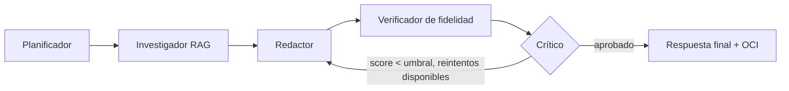

# Informe integral del proyecto NuevaMente

**Sistema Inteligente de Adaptación y Generación de Contenido Educativo**

| Campo | Detalle |
|---|---|
| Proyecto | NuevaMente — Hackathon ONE G10 (Oracle Next Education y Alura), Proyecto 1 |
| Equipo | Kairos G10 (G10-LATAM-equipo 41) |
| Nicho de foco | Salud |
| Periodo cubierto | 21 al 30 de septiembre de 2026 (Sprint 1 y avance del Sprint 2) |
| Repositorio | `No-Country-simulation/G10-LATAM-EQUIPO_41_KAIROS` (rama `SPRINT02`) |
| Project Manager | Juan Pablo Calla |
| Fecha del informe | 1 de octubre de 2026 |

> ⚕️ El contenido que genera esta aplicación es material de apoyo educativo basado en la documentación que el usuario proporciona. **No reemplaza el criterio de un profesional de salud ni las indicaciones oficiales vigentes.**

---

## Estado del proyecto en una mirada

| Indicador | Sprint 1 | Sprint 2 (avance) |
|---|---|---|
| Estado general | Verde | Ámbar |
| Pruebas automatizadas | 69 en verde | 72 en verde |
| Formatos pedagógicos | 5 | 6 (se agregó Podcast) |
| Historias de usuario | — | 89: 72 hechas · 6 parciales · 11 pendientes |
| OCI Object Storage (obligatorio) | Parcial | Parcial: falta la cuenta Always Free, las claves y el bucket |
| Pull requests | PR #1 y #2 integrados en `main` | PR #4 (`SPRINT02` → `main`) en revisión |

**Bloqueos principales:** la cuenta de OCI Always Free sigue sin crearse, así que el requisito obligatorio de Object Storage no está validado en la nube, y la cuota gratuita de Gemini (20 solicitudes por día y modelo) se agota, por lo que parte del material se genera con el modo local.

---

## Contenido

1. [Parte I. El producto](#parte-i-el-producto)
2. [Parte II. Seguimiento de sprints](#parte-ii-seguimiento-de-sprints)
3. [Parte III. Evidencia de pruebas](#parte-iii-evidencia-de-pruebas)
4. [Parte IV. Historias de usuario](#parte-iv-historias-de-usuario)
5. [Fuentes](#fuentes)

---

# Parte I. El producto

Qué hace NuevaMente, cómo está construido y cómo se usa.

## 1. Qué hace

Recibe un documento técnico (PDF, Markdown o texto), lo indexa con RAG, y lo
transforma en contenido educativo personalizado según:

- **Perfil del destinatario:** Principiante, Desarrollador Junior/Semi Senior,
  Líder Técnico/Arquitecto, Gestor/Ejecutivo.
- **Formato pedagógico:** Flashcards, Quiz, Tutorial, Resumen Ejecutivo, Guion
  de Clase, Podcast (solo en audio).
- **Nicho/sector:** General, Fintech, Salud, E-commerce.

Cualquier resultado se puede descargar como **presentación PowerPoint (.pptx)**,
además de Markdown y CSV para Anki (botón "📊 PowerPoint" en la interfaz, o
`GET /api/v1/contenidos/{objeto_id}/exportar?formato=pptx&titulo=...`). Cada formato
tiene su propio diseño: tarjetas pregunta/respuesta, cada pregunta del quiz seguida
de su respuesta, un paso por diapositiva, puntos clave, y las escenas del guion con
la narración en las **notas del orador**.

El **Guion de Clase** además se puede convertir en un **video MP4 narrado**: una
diapositiva por escena con la narración en voz en off (botón "Generar video" en
la interfaz, o `GET /api/v1/contenidos/{objeto_id}/video`).

El **Podcast** es una conversación entre dos locutores: Ana conduce y pregunta,
y Leo explica lo que dice el documento. Se entrega **solo como audio MP3**, con
una voz distinta para cada uno: la interfaz lo graba al terminar y muestra el
reproductor (o `GET /api/v1/contenidos/{objeto_id}/podcast`). No se exporta a
Markdown, Anki ni PowerPoint. Las voces son **naturales, de Gemini TTS** (Ana: *Sulafat*,
cálida; Leo: *Charon*, clara), con tono pausado y claro; se configuran con
`PODCAST_VOCES`, `PODCAST_VOZ_ANA` y `PODCAST_VOZ_LEO`. Si Gemini TTS no está
disponible (sin cuota o sin red), el episodio se narra con las voces del sistema
y la interfaz lo indica. Solo se verifican contra la fuente
las intervenciones de Leo, que son las que llevan contenido del documento.

Cada afirmación generada se **verifica contra el documento fuente** y se le
asigna un score de anclaje. Esto vale para los 6 formatos: en Resumen Ejecutivo
se verifica cada oración del resumen, en Guion de Clase cada escena y en Podcast cada intervención de Leo. Si un
resultado no trae afirmaciones con fuente, no se aprueba y su score es 0. Todo se guarda en OCI Object Storage (o en un
respaldo local si OCI no está configurado) y se expone por API REST y por una
interfaz web (HTML/CSS/JS, servida por la misma API en `http://localhost:8000/`).

## 2. Arquitectura

```
Documento (PDF/MD/TXT)
        │
        ▼
   [Ingesta]  chunking con solapamiento + detección de secciones
        │
        ▼
[RAG local]  TF-IDF (scikit-learn) + vector store propio, aislado por doc_id
        │
        ▼
[Orquestación]  Planificador → Investigador (por sección) → Redactor →
                Verificador de fidelidad → Crítico (con reintento)
        │
        ▼
[Persistencia]  OCI Object Storage (o fallback local en data/fallback/)
        │
        ▼
  API REST (FastAPI)  ──►  Interfaz web (src/nuevamente/web/)
```

### Diagrama de flujo de agentes



## 3. Equipo de trabajo

| Persona | Rol |
|---|---|
| Juan Pablo Calla (PM) | Project Manager |
| Gaspar Martinez Paiva | Data Engineer |
| Bryan Infante | AI Engineer |
| Adrian Gil | ML Engineer |
| Ethan Espinoza Acosta | Backend Developer |
| Dario Higuera Moreno | No Code Developer |
| Diana Dure | QA Tester |

### Quién construyó qué

| Módulo | Responsable | Rol |
|---|---|---|
| `config.py`, arquitectura general, `docs/demo/` | Juan Pablo Calla | Project Manager |
| `ingest/`, `rag/` | Gaspar Martinez Paiva | Data Engineer |
| `agents/graph.py` | Bryan Infante | AI Engineer |
| `llm/`, `fidelity/` | Adrian Gil | ML Engineer |
| `schemas/`, `api/` | Ethan Espinoza Acosta | Backend Developer |
| `web/`, `ui/`, `exports/` | Dario Higuera Moreno | No Code Developer |
| `tests/` | Diana Dure | QA Tester |

## 4. Decisiones de diseño importantes (léelo antes de evaluar el código)

Este entorno de desarrollo **no tiene acceso de red a APIs externas** (Gemini,
OpenAI, Anthropic, ChromaDB Cloud, HuggingFace, OCI real). En vez de simular
resultados con datos inventados, el equipo tomó decisiones de arquitectura que
mantienen el pipeline **100% real y ejecutable**, con una interfaz clara para
conectar los servicios en la nube en la máquina del equipo:

| Pieza | En este entorno | En producción (con credenciales) |
|---|---|---|
| Embeddings | `LocalTfidfEmbeddings` (scikit-learn, sin red) | `GeminiEmbeddings` (por implementar) — mismo contrato `EmbeddingsProvider` |
| Vector store | Store propio en numpy, aislado por `doc_id` | ChromaDB — misma interfaz `buscar`/`buscar_por_seccion` |
| LLM generador | `TemplateLLM` (extractivo, determinista) | `GeminiLLMClient` (por implementar) — misma interfaz `LLMClient` |
| Juez de fidelidad | Similitud TF-IDF contra el chunk citado | LLM juez con cita textual |
| Orquestación | Función Python secuencial con reintento | Migrable a `StateGraph` de LangGraph sin cambiar las etapas |
| OCI Object Storage | Fallback a `data/fallback/` si no hay credenciales | Cliente real vía `oci` SDK (ya integrado, solo requiere `.env`) |

**Importante:** esto no es una simulación con datos falsos. El pipeline corre
de principio a fin sobre el documento real que se le da, indexa contenido
real, recupera evidencia real y verifica fidelidad real contra esa evidencia.
Lo que cambia entre este entorno y producción es *qué tan sofisticado* es el
componente de generación/embeddings, no si el flujo funciona.

## 5. Instalación y uso

```bash
# 1. Instalar el paquete y dependencias
pip install -e ".[dev,ui]"

# 2. Correr los tests (72 pruebas, deben pasar todas)
pytest tests/ -v

# 3. Levantar la API y la interfaz web (un solo proceso)
uvicorn nuevamente.api.app:app --reload
# Interfaz:                  http://localhost:8000/
# Documentación de la API:   http://localhost:8000/docs

# 4. (Opcional) la interfaz Streamlit anterior sigue disponible
streamlit run ui/app.py

# 5. Ejecutar los 3 escenarios de demo (Salud, B2B) y guardar evidencia
python scripts/run_demo.py
```

### Variables de entorno (`.env`, ver `.env.example`)

Copia `.env.example` a `.env`. Se carga al importar `nuevamente.config`: primero el
`.env` del directorio actual y luego el de la raíz del repo. Las variables ya
exportadas en la terminal tienen prioridad sobre las del archivo.

```env
LLM_PROVIDER=template            # "gemini" (pip install -e ".[gemini]") o "claude" (pip install -e ".[claude]")
LLM_MODEL=gemini-3.8-flash
GEMINI_API_KEY=                  # https://aistudio.google.com/apikey
ANTHROPIC_API_KEY=               # https://platform.claude.com/settings/keys (con LLM_PROVIDER=claude)
CLAUDE_MODEL=claude-opus-5
EMBEDDINGS_PROVIDER=local
FIDELITY_MIN_GENERAL=0.85
FIDELITY_MIN_SALUD=0.90          # umbral reforzado para el nicho Salud
OCI_CONFIG_FILE=~/.oci/config
OCI_BUCKET=nuevamente-contenidos-educativos
```

Ver también `docs/SETUP_OCI.md` para crear la cuenta OCI Always Free, el
bucket privado y las claves API paso a paso.

## 6. Ejemplo de uso de la API

```bash
curl -X POST http://localhost:8000/api/v1/adaptar \
  -H "Content-Type: application/json" \
  -d '{
    "documento_titulo": "Protocolo de bioseguridad",
    "documento_contenido": "El lavado de manos con agua y jabón durante al menos 20 segundos elimina la mayoría de los microorganismos de las manos.",
    "perfil_destinatario": "Principiante",
    "formato_salida": "Flashcards",
    "nicho_sector": "Salud"
  }'
```

## 7. Los 3 escenarios de demo (Salud, casos de uso B2B)

Ejecutados por `scripts/run_demo.py` sobre `docs/demo/protocolo_bioseguridad_salud.md`
(documento original del equipo, de dominio general, sin datos de pacientes):

| # | Caso de uso empresarial | Perfil | Formato |
|---|---|---|---|
| 1 | Onboarding de personal clínico nuevo | Principiante | Flashcards |
| 2 | Capacitación regulatoria interna | Desarrollador Junior/Semi Senior | Quiz |
| 3 | Actualización de protocolos ante auditoría | Gestor/Ejecutivo | Resumen Ejecutivo |

Resultados (JSON, Markdown y CSV de Anki) en `docs/demo/resultados/`.

## 8. Checklist del enunciado — estado real

- [x] Ingesta funcional de PDF, Markdown y texto
- [x] RAG con chunking, embeddings y búsqueda vectorial (ver limitación de proveedor arriba)
- [x] Orquestación tipo agentes (Planificador → Investigador → Redactor → Crítico, con reintento)
- [x] Adapta el mismo contenido a los 4 perfiles y los 6 formatos (probado en `tests/test_api.py`)
- [x] Salida JSON estructurada, interfaz web propia + API REST operativa
- [x] Integración con OCI Object Storage, con fallback local documentado y visible
- [x] Verificación de fidelidad con score y afirmaciones no sustentadas
- [x] 3 ejemplos de ejecución reales, documentados como casos de uso B2B en Salud
- [x] Tests automatizados (72), incluida seguridad ante inyección de instrucciones
- [ ] Despliegue en OCI Compute (pendiente — diferencial opcional)
- [ ] Conectar `GeminiLLMClient` real en la máquina del equipo (con API key)

## 9. Estructura del repositorio

```
nuevamente/
├── src/nuevamente/
│   ├── config.py
│   ├── schemas/        # enums, request, response, formatos (Ethan)
│   ├── ingest/          # lectores + chunking (Gaspar)
│   ├── rag/             # embeddings + vector store (Gaspar)
│   ├── llm/              # LLMClient, TemplateLLM, fábrica (Adrian)
│   ├── agents/           # orquestación (Bryan)
│   ├── fidelity/         # verificación de fidelidad (Adrian)
│   ├── storage/          # cliente OCI + fallback (Ethan/Gaspar)
│   ├── exports/          # Markdown, CSV Anki, PowerPoint, video MP4 y narración (Dario)
│   ├── api/              # FastAPI (Ethan)
│   └── web/              # Interfaz web: index.html, styles.css, app.js (Dario)
├── ui/app.py              # Interfaz Streamlit anterior (opcional)
├── scripts/
│   ├── oci_bootstrap.py   # crea/verifica el bucket OCI
│   └── run_demo.py        # corre los 3 escenarios de Salud
├── tests/                  # 72 pruebas (Diana)
├── docs/
│   ├── SETUP_OCI.md
│   └── demo/
│       ├── protocolo_bioseguridad_salud.md
│       └── resultados/
├── pyproject.toml
├── .env.example
└── README.md
```

## 10. Seguridad y manejo responsable del nicho Salud

- El documento de demo es contenido original del equipo, de carácter general,
  **sin datos de pacientes** y sin indicaciones de dosificación de medicamentos.
- El umbral de fidelidad para Salud es más estricto (0.90) que el general (0.85).
- La interfaz muestra un aviso visible cuando el nicho seleccionado es Salud.
- La interfaz web inserta todo el texto del documento como texto, nunca como HTML,
  así que un documento con etiquetas o scripts no puede ejecutar código en el navegador.
- El contenido del documento se trata siempre como **datos**, nunca como
  instrucciones (ver `tests/test_security.py`).

## 11. Video del Guion de Clase

- Las diapositivas se dibujan con Pillow y ffmpeg arma el MP4 (H.264 + AAC, 1280×720).
  Se usa el ffmpeg del sistema y, si no hay, el que trae el paquete `imageio-ffmpeg`.
- **Voz femenina o masculina**, a elección en la interfaz (con botón para escuchar una
  muestra) o con `?voz=femenina|masculina` en la API. Se usa una voz en español del
  sistema: `say` en macOS o `espeak-ng` en Linux (`sudo apt install espeak-ng`). Sin
  voz disponible, o con `VIDEO_TTS=off`, cada escena se muestra en silencio.
- **Lectura natural** (`exports/narracion.py`): antes de leer, el texto se adapta
  para la voz (fechas en palabras, abreviaturas expandidas, siglas deletreadas, sin
  restos de tablas ni Markdown); el ritmo es algo más pausado, con silencios entre
  oraciones; la clase abre con un saludo, enlaza escenas con transiciones y cierra
  con una despedida; el volumen se normaliza y las diapositivas entran y salen con
  un fundido.
- Para una voz todavía más natural en macOS, descarga una versión **mejorada** o
  **premium** (por ejemplo "Paulina (mejorada)" o "Juan (mejorada)") en *Ajustes del
  Sistema → Accesibilidad → Contenido leído → Voz del sistema → Gestionar voces*.
  Kairos la prefiere automáticamente sobre la versión básica.
- El video se genera la primera vez que se pide y queda en caché en `data/videos/`.
  Un guion de 8 escenas tarda unos 30 segundos en generarse.

## 12. Limitaciones conocidas del generador local (`TemplateLLM`)

- Es extractivo: no traduce, así que `idioma_salida` se acepta pero hoy no cambia la salida.
- Es determinista: ignora la retroalimentación del Crítico, por eso el flujo corta
  los reintentos cuando el resultado sale idéntico al intento anterior.
- En el Quiz, los distractores son oraciones reales de *otras* secciones del
  documento; la correcta es la que corresponde a la sección que nombra la pregunta.

---

# Parte II. Seguimiento de sprints

Informes del Project Manager de cada sprint.

## Sprint 1

*Periodo: 21 al 27 de septiembre de 2026 · Elaborado por Juan Pablo Calla, Project Manager, el 27 de septiembre de 2026.*

### 1. Datos generales

| Campo | Detalle |
|---|---|
| Proyecto            | NuevaMente — Hackathon ONE G10, Proyecto 1                                                                               |
| Equipo              | Kairos G10 (G10-LATAM-equipo 41)                                                                                         |
| Sprint              | Sprint 1 (semana 1)                                                                                                      |
| Periodo             | 21 al 27 de septiembre de 2026                                                                                           |
| Project Manager     | Juan Pablo Calla                                                                                                         |
| Objetivo del sprint | Construir un MVP funcional de punta a punta: ingesta, RAG, generación con IA, verificación de fidelidad, API e interfaz. |
| Estado general      | Verde                                                                                                                    |

### 2. Resumen ejecutivo

El equipo cerró el Sprint 1 con un MVP que funciona de punta a punta. La aplicación recibe un documento técnico (PDF, Markdown o texto), lo divide en secciones, recupera la evidencia de cada una y genera material de estudio adaptado al perfil, al formato, al sector y al nivel de detalle. Cada afirmación se verifica contra el documento y recibe un score de fidelidad.

Quedaron operativos 5 formatos pedagógicos (Flashcards, Quiz, Tutorial, Resumen Ejecutivo y Guion de Clase) para los 4 perfiles de destinatario, la API REST, la interfaz web, la interfaz Streamlit y 69 pruebas automatizadas. Los 3 escenarios de demo en Salud fueron aprobados por el Crítico.

El principal pendiente es OCI Object Storage, requisito obligatorio: la integración está en el código, pero falta crear la cuenta Always Free, las claves y el bucket. Mientras tanto, los resultados se guardan en un respaldo local y la respuesta lo indica.

### 3. Objetivos del sprint

| Objetivo                          | Estado | Comentario                                                                             |
|---------------------------------------|------------|--------------------------------------------------------------------------------------------|
| Ingesta de PDF, Markdown y texto      | Cumplido   | Lectura de los tres formatos, con validación de tamaño y de documentos vacíos.             |
| RAG con chunking y búsqueda vectorial | Cumplido   | Chunking con solapamiento, TF-IDF local y recuperación por sección, aislada por documento. |
| Orquestación de agentes con reintento | Cumplido   | Planificador → Investigador → Redactor → Verificador → Crítico.                            |
| Generación con IA (Gemini)            | Cumplido   | Conectada, con modelos de respaldo y generador local si la IA no responde.                 |
| Verificación de fidelidad             | Cumplido   | Score por afirmación; umbral 0,85 general y 0,90 en Salud.                                 |
| API REST e interfaz                   | Cumplido   | FastAPI con salida JSON estructurada, interfaz web y Streamlit.                            |
| Formatos pedagógicos                  | Cumplido   | 5 formatos para los 4 perfiles, probados en pruebas automatizadas.                         |
| Persistencia en OCI Object Storage    | Parcial    | Código listo con respaldo local; falta la cuenta, las claves y el bucket.                  |
| 3 escenarios de demo en Salud         | Cumplido   | Ejecutados y documentados como casos de uso B2B.                                           |

### 4. Entregables y logros

#### Producto

- **Ingesta:** PDF, Markdown y texto plano, con detección de secciones por encabezados.

- **RAG:** fragmentos con solapamiento y `chunk_id` estable, índice aislado por documento y recuperación por sección.

- **IA generativa:** Google Gemini con salida JSON validada, modelos de respaldo y generador local de último recurso.

- **Fidelidad:** score de anclaje, afirmaciones no sustentadas y umbral reforzado para Salud.

- **Formatos:** Flashcards, Quiz, Tutorial, Resumen Ejecutivo y Guion de Clase.

- **Exportación:** Markdown, CSV para Anki, PowerPoint y video MP4 narrado del guion de clase.

- **Interfaz:** interfaz web servida por la API en `http://localhost:8000/` y Streamlit como alternativa.

#### Calidad y demo

- **Pruebas:** 69 pruebas automatizadas en verde, incluida la resistencia a inyección de instrucciones.

- **Demo:** 3 escenarios sobre un documento original de bioseguridad, sin datos de pacientes.

#### Gestión y repositorio

- **Repositorio:** código en `No-Country-simulation/G10-LATAM-EQUIPO_41_KAIROS`, con una rama por integrante.

- **Pull requests:** PR \#1 (24/09) agregó el proyecto; PR \#2 (25/09) lo movió a la raíz con el proveedor Gemini y prompts editables. Ambos fueron integrados a main.

- **Documentación:** README con arquitectura, decisiones de diseño e instalación; guía `docs/SETUP_OCI.md` para la cuenta Always Free.

### 5. Métricas

| Indicador                                     | Valor        | Observación                                                 |
|---------------------------------------------------|------------------|-----------------------------------------------------------------|
| Pruebas automatizadas                         | 69 en verde      | Ingesta, RAG, esquemas, fidelidad, generación, seguridad y API. |
| Formatos pedagógicos                          | 5 de 5 previstos | Probados con los 4 perfiles.                                    |
| Perfiles de destinatario                      | 4                | Principiante, Desarrollador, Líder Técnico, Gestor.             |
| Escenario 1 · Onboarding (Flashcards)         | Fidelidad 0,94   | Generado con Gemini (gemini-3.5-flash).                         |
| Escenario 2 · Capacitación regulatoria (Quiz) | Fidelidad 1,00   | Generado con Gemini (gemini-flash-latest).                      |
| Escenario 3 · Auditoría (Resumen Ejecutivo)   | Fidelidad 1,00   | Generador local: Gemini no disponible en esa corrida.           |
| Pull requests integrados                      | 2                | PR \#1 y PR \#2.                                                |

### 6. Cumplimiento de requisitos del hackathon

| Requisito                                  | Estado | Detalle                                                     |
|------------------------------------------------|------------|-----------------------------------------------------------------|
| Ingesta de PDF, Markdown y texto               | Cumplido   | Lectores con validación.                                        |
| RAG: chunking, embeddings y búsqueda vectorial | Cumplido   | Embeddings TF-IDF locales; Gemini embeddings queda como mejora. |
| Orquestación tipo agentes con reintento        | Cumplido   | Flujo secuencial migrable a LangGraph.                          |
| Adaptación a 4 perfiles y varios formatos      | Cumplido   | 5 formatos en este sprint.                                      |
| Salida JSON estructurada y API REST            | Cumplido   | FastAPI con documentación en `/docs`.                             |
| Verificación de fidelidad                      | Cumplido   | Score y afirmaciones no sustentadas.                            |
| OCI Object Storage (obligatorio)               | Parcial    | Código listo; falta crear la cuenta y el bucket.                |
| OCI Compute (opcional)                         | Pendiente  | Diferencial para sprints siguientes.                            |
| Ejemplos de ejecución documentados             | Cumplido   | 3 escenarios B2B en Salud.                                      |

### 7. Riesgos e impedimentos

| Riesgo o impedimento                                                       | Impacto | Estado | Acción / mitigación                                                                                        | Resp.    |
|--------------------------------------------------------------------------------|-------------|------------|----------------------------------------------------------------------------------------------------------------|--------------|
| Cuenta OCI Always Free sin crear: requisito obligatorio sin validar en la nube | Alta        | Abierto    | Seguir `docs/SETUP_OCI.md`, crear el bucket con `scripts/oci_bootstrap.py` y verificar `status_upload` «completado». | Juan / Ethan |
| Gemini principal (gemini-3.7-flash) responde 503 por alta demanda              | Media       | Mitigado   | Modelos de respaldo y generador local; evaluar un modelo principal estable.                                    | Adrian       |
| Costos en OCI si se crean recursos fuera de Always Free                        | Alta        | Abierto    | Crear solo recursos Always Free, no pasar a Pay As You Go y crear un presupuesto de 1 USD con alerta.          | Juan         |
| Contenido de salud sensible                                                    | Media       | Mitigado   | Documento de demo sin datos de pacientes, umbral 0,90 y aviso visible en la interfaz.                          | Juan         |

### 8. Equipo

| Integrante            | Rol           | Aporte en el sprint                                             |
|---------------------------|-------------------|---------------------------------------------------------------------|
| Juan Pablo Calla      | Project Manager   | Configuración, arquitectura general, documentación y demo.          |
| Gaspar Martinez Paiva | Data Engineer     | Ingesta y RAG.                                                      |
| Bryan Infante         | AI Engineer       | Orquestación de agentes.                                            |
| Adrian Gil            | ML Engineer       | Capa LLM y verificación de fidelidad.                               |
| Ethan Espinoza Acosta | Backend Developer | Esquemas y API REST.                                                |
| Dario Higuera Moreno  | No Code Developer | Interfaz web, Streamlit y exportaciones; integró el PR \#2 en main. |
| Diana Dure            | QA Tester         | Pruebas automatizadas.                                              |

### 9. Decisiones del sprint

- **Pipeline 100% ejecutable:** en lugar de simular resultados, cada componente tiene una versión local que funciona sin red y una interfaz para conectar el servicio en la nube.

- **Respaldo local visible:** si OCI o Gemini fallan, la aplicación no se cae y la respuesta indica el respaldo usado.

- **Umbral reforzado para Salud:** 0,90 frente a 0,85 en los demás sectores.

- **Una sola aplicación:** la API sirve también la interfaz web, para la demo con un solo comando.

### 10. Lecciones aprendidas

- **Lo que funcionó:** dividir el sistema en módulos con un responsable cada uno permitió avanzar en paralelo.

- **Lo que funcionó:** tener un respaldo local evitó que la demo dependiera de la disponibilidad de Gemini.

- **A mejorar:** la cuenta de OCI debe crearse al inicio del sprint, porque es un requisito obligatorio y depende de trámites externos.

- **A mejorar:** elegir un modelo de Gemini estable antes de ejecutar la demo.

### 11. Plan para el siguiente periodo

| \# | Tarea                                                                                         | Responsable | Prioridad |
|--------|---------------------------------------------------------------------------------------------------|-----------------|---------------|
| 1      | Crear la cuenta OCI Always Free, las claves y el bucket; verificar `status_upload` «completado»     | Juan / Ethan    | Alta          |
| 2      | Cambiar el modelo principal de Gemini a uno estable y repetir los 3 escenarios de demo con Gemini | Adrian / Juan   | Alta          |
| 3      | Generar prerrequisitos y conceptos clave con el LLM                                               | Bryan           | Media         |
| 4      | Agregar una evaluación de coherencia didáctica                                                    | Adrian          | Media         |
| 5      | Conectar el proyecto al repositorio de GitHub y trabajar por ramas                                | Juan            | Alta          |

**Fuentes del sprint:** `docs/entregables/semana_1.md`, historial del repositorio en GitHub (PR \#1 y \#2), README y `docs/demo/resultados/`.

---

## Sprint 2 (informe de avance)

*Periodo: 28 al 30 de septiembre de 2026 · Elaborado por Juan Pablo Calla, Project Manager, el 30 de septiembre de 2026.*

### 1. Datos generales

| Campo | Detalle |
|---|---|
| Proyecto            | NuevaMente — Hackathon ONE G10, Proyecto 1                                                                                    |
| Equipo              | Kairos G10 (G10-LATAM-equipo 41)                                                                                              |
| Sprint              | Sprint 2 (en curso)                                                                                                           |
| Periodo informado   | 28 al 30 de septiembre de 2026                                                                                                |
| Project Manager     | Juan Pablo Calla                                                                                                              |
| Objetivo del sprint | Mejorar la calidad y presentación del material, cerrar los pendientes del Sprint 1 y ordenar el trabajo del equipo en GitHub. |
| Estado general      | Ámbar                                                                                                                         |

### 2. Resumen ejecutivo

En los primeros tres días del Sprint 2 se mejoró la calidad del material generado. El sistema ahora reconoce las secciones de un PDF, muestra cada parte bajo el título de su sección, elimina los duplicados y usa una numeración y viñetas uniformes. Se incorporó el formato Podcast, se agregó una barra de progreso con porcentaje y el material cubre todas las secciones del documento.

Los cambios se subieron a la rama `SPRINT02` con el pull request \#4 hacia main, pendiente de revisión del equipo. Se documentaron las 89 historias de usuario del producto: 72 hechas, 6 parciales y 11 pendientes.

El estado es ámbar por dos bloqueos externos: la cuenta de OCI Always Free sigue sin crearse, así que el requisito obligatorio de Object Storage no está validado en la nube, y la cuota gratuita de Gemini (20 solicitudes por día y modelo) se agota, por lo que parte del material se genera con el modo local.

### 3. Objetivos del sprint

| Objetivo                                                | Estado  | Comentario                                                         |
|-------------------------------------------------------------|-------------|------------------------------------------------------------------------|
| Material organizado por secciones, con títulos y subtítulos | Cumplido    | Detección de títulos en PDF y agrupación en la interfaz y en Markdown. |
| Eliminar duplicados y unificar numeración y viñetas         | Cumplido    | Depuración automática y renumeración sin huecos.                       |
| Formato Podcast                                             | Cumplido    | Conversación de Ana y Leo, solo en audio MP3.                          |
| Barra de progreso con porcentaje                            | Cumplido    | Porcentaje por etapa; nunca marca 100% antes de terminar.              |
| Configurar OCI Object Storage                               | No cumplido | Falta crear la cuenta Always Free, las claves y el bucket.             |
| Modelo de Gemini estable y demo con Gemini                  | Parcial     | La cuota gratuita diaria se agota; se mantiene el respaldo local.      |
| Prerrequisitos y conceptos clave con el LLM                 | Pendiente   | Trasladado al resto del sprint.                                        |
| Evaluación de coherencia didáctica                          | Pendiente   | Trasladado al resto del sprint.                                        |
| Trabajo por ramas en GitHub                                 | Cumplido    | Rama `SPRINT02` y PR \#4 hacia main.                                     |

### 4. Entregables y logros

#### Calidad del material

- **Secciones en PDF:** se reconocen títulos numerados y en mayúsculas; se muestran sin la numeración de origen y conservando siglas.

- **Títulos por sección:** cada tarjeta, pregunta, paso y escena indica su sección y se agrupa bajo ella.

- **Sin duplicados:** se quitan las partes que repiten el 85% o más de las palabras de otra, y se renumera en orden.

- **Formato uniforme:** secciones sin número, partes numeradas (Tarjeta, Pregunta, Paso, Escena) y una sola viñeta.

- **Cobertura:** el material se reparte entre todas las secciones y no repite enunciados dentro de una sección.

- **Título correcto:** el material toma el nombre del archivo subido y no el del archivo temporal.

#### Nuevas funciones

- **Podcast:** conversación entre Ana y Leo en MP3, con voces naturales de Gemini TTS y respaldo con voces del sistema.

- **Barra de progreso:** porcentaje grande y etapa actual mientras se crea el material.

- **Proveedor Claude:** integrado como alternativa, pero desactivado porque la cuenta no tiene crédito y el proyecto debe ser gratuito.

#### Gestión, documentación y despliegue

- **Historias de usuario:** documento Word con 89 historias en 14 épicas (`docs/entregables/Historias_de_Usuario_NuevaMente.docx`).

- **Revisión de OCI:** el código cumple el requisito; faltan la cuenta, las claves, la librería oci y guardar el PDF original tal cual.

- **`requirements.txt`:** generado y probado en un entorno limpio para el despliegue.

- **GitHub:** rama `SPRINT02` y PR \#4 hacia main. Diana actualizó el README con la columna de reemplazos del equipo.

### 5. Métricas

| Indicador                      | Valor                       | Observación                                                 |
|------------------------------------|---------------------------------|-----------------------------------------------------------------|
| Pruebas automatizadas          | 72 en verde                     | +3 respecto del Sprint 1 (`tests/test_depuracion.py`).            |
| Formatos pedagógicos           | 6                               | +1: Podcast.                                                    |
| Historias de usuario           | 89                              | 72 hechas · 6 parciales · 11 pendientes.                        |
| Épicas                         | 14                              | Desde ingesta hasta calidad y entregables.                      |
| Prueba con PDF de 12 secciones | Fidelidad 0,90 a 1,00           | 6 formatos, sin títulos repetidos y con numeración consecutiva. |
| Pull requests abiertos         | 1                               | PR \#4 (`SPRINT02` → main), pendiente de revisión.                |
| Cuota gratuita de Gemini       | 20 solicitudes por día y modelo | Se agota; el material cae al modo local.                        |

### 6. Cumplimiento de requisitos del hackathon

| Requisito                                  | Estado | Detalle                                                                           |
|------------------------------------------------|------------|---------------------------------------------------------------------------------------|
| Ingesta de PDF, Markdown y texto               | Cumplido   | Ahora con detección de secciones en PDF.                                              |
| RAG: chunking, embeddings y búsqueda vectorial | Cumplido   | Cobertura de todas las secciones.                                                     |
| Orquestación tipo agentes con reintento        | Cumplido   | Con depuración de duplicados antes de verificar.                                      |
| Adaptación a 4 perfiles y varios formatos      | Cumplido   | 6 formatos.                                                                           |
| Salida JSON estructurada y API REST            | Cumplido   | Cada parte incluye su sección.                                                        |
| Verificación de fidelidad                      | Cumplido   | Sin cambios; incluye el Podcast.                                                      |
| OCI Object Storage (obligatorio)               | Parcial    | Código listo; falta la cuenta, las claves, la librería oci y guardar el PDF original. |
| OCI Compute (opcional)                         | Pendiente  | Sin despliegue preparado.                                                             |
| Uso exclusivo de la capa gratuita              | Cumplido   | Gemini gratuito y modo local; Claude desactivado.                                     |

### 7. Riesgos e impedimentos

| Riesgo o impedimento                                                                | Impacto | Estado | Acción / mitigación                                                                                      | Resp.    |
|-----------------------------------------------------------------------------------------|-------------|------------|--------------------------------------------------------------------------------------------------------------|--------------|
| Cuenta OCI Always Free sin crear: el requisito obligatorio sigue sin validar en la nube | Alta        | Abierto    | Crear la cuenta esta semana, ejecutar `scripts/oci_bootstrap.py` y agregar oci a `requirements.txt`.             | Juan / Ethan |
| Cuota gratuita de Gemini agotada (20 solicitudes por día y modelo)                      | Media       | Mitigado   | Respaldo local automático; repartir las pruebas en el día y reservar cuota para la demo.                     | Adrian       |
| Sin crédito en la cuenta de Claude                                                      | Baja        | Resuelto   | Proveedor desactivado; solo servicios gratuitos, según el aviso de ONE.                                      | Juan         |
| El servidor local se trabó tras más de un día encendido                                 | Media       | Mitigado   | Se reinició; si se repite, revisar qué solicitud lo bloquea y reiniciar el servidor a diario en las pruebas. | Ethan        |
| Cambios en la computadora del PM que aún no están en la rama `SPRINT02`                   | Media       | Abierto    | Subir barra de progreso, `requirements.txt`, historias de usuario e informes a `SPRINT02`.                       | Juan         |
| Reasignación de roles: dos integrantes con reemplazo                                    | Media       | Mitigado   | Ethan cubre el rol de AI Engineer y Gaspar el de ML Engineer; actualizar responsables en las historias.      | Juan         |

### 8. Equipo

Según el README del repositorio actualizado por Diana, Ethan Espinoza Acosta reemplaza a Bryan Infante (AI Engineer) y Gaspar Martinez Paiva reemplaza a Adrian Gil (ML Engineer).

| Integrante            | Rol                                      | Aporte en el sprint                                                                                    |
|---------------------------|----------------------------------------------|------------------------------------------------------------------------------------------------------------|
| Juan Pablo Calla      | Project Manager                              | Mejoras de calidad del material, Podcast, proveedores de IA, historias de usuario, rama `SPRINT02` y PR \#4. |
| Gaspar Martinez Paiva | Data Engineer · reemplazo de ML Engineer     | Sin commits registrados en el repositorio en este periodo.                                                 |
| Ethan Espinoza Acosta | Backend Developer · reemplazo de AI Engineer | Sin commits registrados en el repositorio en este periodo.                                                 |
| Dario Higuera Moreno  | No Code Developer                            | Limpieza del repositorio (eliminó la carpeta de pruebas del 28/09).                                        |
| Diana Dure            | QA Tester                                    | Actualización del README (reemplazos del equipo) y carpeta de documentos de prueba.                        |
| Bryan Infante         | AI Engineer                                  | Reemplazado por Ethan Espinoza Acosta.                                                                     |
| Adrian Gil            | ML Engineer                                  | Reemplazado por Gaspar Martinez Paiva.                                                                     |

### 9. Decisiones del sprint

- **Solo servicios gratuitos:** la generación usa Gemini en su plan gratuito con respaldo local; Claude queda integrado pero desactivado.

- **La sección la calcula el sistema:** cada parte toma la sección de su fragmento de origen, no la decide el modelo.

- **Regla única de formato:** secciones sin número, partes numeradas y una sola viñeta en la interfaz y en Markdown.

- **Trabajo por sprint en ramas:** los cambios van a `SPRINT02` y llegan a main por pull request, sin tocar el trabajo en curso de los compañeros.

- **Credenciales fuera del repositorio:** `.env` no se sube y se revisa que no haya claves antes de cada subida.

### 10. Lecciones aprendidas (parciales)

- **Lo que funcionó:** probar con un PDF real (manual de un router con 12 secciones) reveló problemas que el documento de demo no mostraba.

- **Lo que funcionó:** las pruebas automatizadas permitieron cambiar el pipeline sin romper lo existente (72 en verde).

- **A mejorar:** la dependencia de cuentas externas (OCI, Gemini, Claude) debe resolverse al inicio del sprint.

- **A mejorar:** subir los cambios a la rama con más frecuencia, para que el equipo trabaje sobre la última versión.

### 11. Plan para el siguiente periodo

| \# | Tarea                                                                                          | Responsable | Prioridad |
|--------|----------------------------------------------------------------------------------------------------|-----------------|---------------|
| 1      | Crear la cuenta OCI Always Free, las claves y el bucket; verificar `status_upload` «completado»      | Juan / Ethan    | Alta          |
| 2      | Agregar la librería oci a `requirements.txt`                                                         | Juan            | Alta          |
| 3      | Subir a `SPRINT02` la barra de progreso, `requirements.txt`, las historias de usuario y estos informes | Juan            | Alta          |
| 4      | Revisar e integrar el PR \#4 en main                                                               | Dario / Diana   | Alta          |
| 5      | Guardar en el bucket el archivo original tal cual (PDF)                                            | Ethan           | Media         |
| 6      | Repetir los 3 escenarios de demo con Gemini, reservando cuota                                      | Juan / Gaspar   | Media         |
| 7      | Títulos de sección en la exportación PowerPoint                                                    | Dario           | Media         |
| 8      | Prerrequisitos y conceptos clave con el LLM; evaluación de coherencia didáctica                    | Ethan / Gaspar  | Media         |
| 9      | Despliegue en OCI Compute Always Free (diferencial opcional)                                       | Juan / Ethan    | Baja          |
| 10     | Informe de la semana 2 al cierre del sprint                                                        | Juan            | Media         |

**Fuentes del sprint:** Rama `SPRINT02` y PR \#4 del repositorio, historial de commits del equipo, Historias_de_Usuario_NuevaMente.docx y pruebas ejecutadas el 28–30 de septiembre de 2026.

---

# Parte III. Evidencia de pruebas

Resultados de las pruebas automatizadas por ticket.

## Pruebas del pipeline RAG y del respaldo local (SCRUM-21 a SCRUM-24)

*Área: Data Engineering / IA · Responsables: Gaspar Martinez, Bryan Infante y Adrian Gil · Sprint 2*

Esta sección reúne la evidencia de las pruebas automatizadas que pasaron en los módulos de ingesta, fragmentación, vectorización local y generación sin conexión.

| Ticket | Alcance | Archivo de prueba | Resultado |
|---|---|---|---|
| SCRUM-21 y SCRUM-22 | Ingesta de documentos y chunking | `tests/test_ingest.py` | 5 pruebas aprobadas (6,12 s) |
| SCRUM-23 | Embeddings locales TF-IDF y vector store | `tests/test_vectorstore.py` | 3 pruebas aprobadas (3,64 s) |
| SCRUM-24 | TemplateLLM, generador sin conexión | `tests/test_generacion.py` | 9 pruebas aprobadas (8,90 s) |

### 1. SCRUM-21 y SCRUM-22: Ingesta de Documentos y Chunking

**Módulos probados:** `src/nuevamente/ingest/readers.py` y `src/nuevamente/ingest/chunking.py`  
**Archivo de test:** `tests/test_ingest.py`

**Criterios de Aceptación Verificados:**
- [x] (SCRUM-21) Lectura correcta de formatos de entrada (PDF, Markdown, TXT).
- [x] (SCRUM-22) División de texto (chunking) garantizando el tamaño máximo y solapamiento (overlap).
- [x] (SCRUM-22) Detección automática de secciones por encabezados sin cortar oraciones a la mitad.
- [x] (SCRUM-22) Generación de un ID determinista (`doc_id`) para trazabilidad de cada fragmento.

**Evidencia de Ejecución:**
```
pytest tests/test_ingest.py
5 passed in 6.12s
Estado: APROBADO
```

### 2. SCRUM-23: Embeddings Locales (TF-IDF) y Vector Store

**Módulos probados:** `src/nuevamente/rag/embeddings.py` y `src/nuevamente/rag/vectorstore.py`  
**Archivo de test:** `tests/test_vectorstore.py`

**Criterios de Aceptación Verificados:**
- [x] Vectorización determinista local utilizando TfidfVectorizer (scikit-learn).
- [x] Almacenamiento aislado en memoria agrupado por documento (`doc_id`).
- [x] Recuperación precisa mediante Similitud de Coseno.

**Evidencia de Ejecución:**
```
pytest tests/test_vectorstore.py
3 passed in 3.64s
Estado: APROBADO
```

### 3. SCRUM-24: TemplateLLM (Generador Determinista Offline)

**Módulos probados:** `src/nuevamente/llm/template_llm.py` y `src/nuevamente/agents/graph.py`  
**Archivo de test:** `tests/test_generacion.py`

**Criterios de Aceptación Verificados:**
- [x] Funcionamiento 100% offline (sin llamadas a red) utilizando `LLM_PROVIDER=template`.
- [x] Inserción de la respuesta dentro de los esquemas Pydantic requeridos (JSON) listos para la interfaz.
- [x] Integridad del fallback automático garantizada frente a caídas de API.

**Evidencia de Ejecución:**
```
pytest tests/test_generacion.py
9 passed in 8.90s
Estado: APROBADO
```

---

# Parte IV. Historias de usuario

Las 89 historias del producto en 14 épicas, con su estado al 29 de septiembre de 2026.

## Introducción

Este documento reúne todas las historias de usuario de Kairos G10-NuevaMente, tanto las que ya están implementadas como las que siguen pendientes. Sirve para planificar los próximos sprints, seguir el avance del producto y mostrar a los evaluadores qué cubre el sistema y qué falta.

Contiene **89 historias** organizadas en **14 épicas**: 72 están hechas, 6 están en parte y 11 están pendientes. El estado corresponde al código de la rama `SPRINT02` al 29 de septiembre de 2026.

### Cómo leer cada historia

- **Historia:** «Como <rol>, quiero <necesidad>, para <beneficio>».
- **Criterios de aceptación:** condiciones que deben cumplirse para dar la historia por terminada.
- **Prioridad (MoSCoW):** Debe (imprescindible para el MVP), Debería (importante), Podría (deseable).
- **Estado:** Hecho (implementado y probado), Parcial (implementado en parte o falta configuración) y Pendiente (no implementado).
- **Responsable:** integrante a cargo del módulo, según la tabla «Quién construyó qué» del README.

### Roles de usuario

- **Estudiante:** persona que aprende a partir de un documento técnico.
- **Desarrollador junior, líder técnico y gestor:** perfiles de destinatario con distinta profundidad.
- **Capacitador y profesional de salud:** quienes preparan formación a partir de protocolos y documentación.
- **Integrador de sistemas:** quien consume la API REST desde otra plataforma.
- **Operador de la plataforma y equipo de desarrollo:** quienes configuran, despliegan y mantienen el sistema.
- **Evaluador del hackathon y equipo del programa ONE:** quienes revisan el cumplimiento de los requisitos.

---

## Resumen por épica

| Épica | Nombre | Total | Hecho | Parcial | Pendiente |
|---|---|:-:|:-:|:-:|:-:|
| E01 | Ingesta de documentos | 8 | 7 | 0 | 1 |
| E02 | Recuperación de evidencia (RAG) | 5 | 3 | 0 | 2 |
| E03 | Personalización del material | 5 | 4 | 1 | 0 |
| E04 | Formatos pedagógicos | 6 | 6 | 0 | 0 |
| E05 | Orquestación y generación con IA | 9 | 7 | 1 | 1 |
| E06 | Verificación de fidelidad | 5 | 3 | 0 | 2 |
| E07 | Presentación del material | 5 | 5 | 0 | 0 |
| E08 | Exportación multiformato | 8 | 7 | 0 | 1 |
| E09 | Persistencia en OCI Object Storage | 7 | 4 | 1 | 2 |
| E10 | Interfaz web | 9 | 9 | 0 | 0 |
| E11 | API REST | 6 | 6 | 0 | 0 |
| E12 | Seguridad y uso responsable | 5 | 5 | 0 | 0 |
| E13 | Despliegue y operación | 6 | 3 | 2 | 1 |
| E14 | Calidad, pruebas y entregables | 5 | 3 | 1 | 1 |
| | **Total** | **89** | **72** | **6** | **11** |

---

## Índice de historias

### E01 · Ingesta de documentos

| ID | Historia | Prioridad | Estado |
|---|---|---|---|
| HU-01 | Pegar el texto de un documento | Debe | Hecho |
| HU-02 | Subir un archivo PDF, Markdown o TXT | Debe | Hecho |
| HU-03 | Límite de tamaño de archivo | Debe | Hecho |
| HU-04 | Aviso de PDF sin texto extraíble | Debería | Hecho |
| HU-05 | Detección de las secciones del documento | Debe | Hecho |
| HU-06 | Limpieza del texto extraído | Debería | Hecho |
| HU-07 | Documento de ejemplo | Podría | Hecho |
| HU-08 | Reconocimiento de texto (OCR) en PDF escaneados | Podría | Pendiente |

### E02 · Recuperación de evidencia (RAG)

| ID | Historia | Prioridad | Estado |
|---|---|---|---|
| HU-09 | Fragmentación con solapamiento | Debe | Hecho |
| HU-10 | Índice aislado por documento | Debe | Hecho |
| HU-11 | Recuperación de evidencia por sección | Debe | Hecho |
| HU-12 | Embeddings semánticos con Gemini | Podría | Pendiente |
| HU-13 | Almacén vectorial ChromaDB | Podría | Pendiente |

### E03 · Personalización del material

| ID | Historia | Prioridad | Estado |
|---|---|---|---|
| HU-14 | Elegir el perfil del destinatario | Debe | Hecho |
| HU-15 | Elegir el formato pedagógico | Debe | Hecho |
| HU-16 | Elegir el sector o nicho | Debe | Hecho |
| HU-17 | Elegir el nivel de detalle | Debería | Hecho |
| HU-18 | Elegir el idioma de salida | Podría | Parcial |

### E04 · Formatos pedagógicos

| ID | Historia | Prioridad | Estado |
|---|---|---|---|
| HU-19 | Flashcards interactivas | Debe | Hecho |
| HU-20 | Quiz autocorregible | Debe | Hecho |
| HU-21 | Tutorial paso a paso | Debe | Hecho |
| HU-22 | Resumen ejecutivo | Debe | Hecho |
| HU-23 | Guion de clase | Debe | Hecho |
| HU-24 | Podcast con dos locutores | Debería | Hecho |

### E05 · Orquestación y generación con IA

| ID | Historia | Prioridad | Estado |
|---|---|---|---|
| HU-25 | Flujo de agentes con reintento | Debe | Hecho |
| HU-26 | Generación con Google Gemini | Debe | Hecho |
| HU-27 | Respaldo local cuando la IA no está disponible | Debe | Hecho |
| HU-28 | Proveedor alternativo Claude | Podría | Hecho |
| HU-29 | Operar solo con servicios gratuitos | Debe | Hecho |
| HU-30 | Prompts editables en un solo lugar | Debería | Hecho |
| HU-31 | Modelo principal de Gemini estable | Debería | Parcial |
| HU-32 | Prerrequisitos y conceptos clave generados por la IA | Podría | Pendiente |
| HU-33 | Tiempo estimado de estudio | Podría | Hecho |

### E06 · Verificación de fidelidad

| ID | Historia | Prioridad | Estado |
|---|---|---|---|
| HU-34 | Verificar cada afirmación contra su fuente | Debe | Hecho |
| HU-35 | Score de anclaje y umbral por sector | Debe | Hecho |
| HU-36 | Ver las afirmaciones no sustentadas | Debe | Hecho |
| HU-37 | Evaluación de coherencia didáctica | Podría | Pendiente |
| HU-38 | Juez de fidelidad con IA | Podría | Pendiente |

### E07 · Presentación del material

| ID | Historia | Prioridad | Estado |
|---|---|---|---|
| HU-39 | Título y subtítulo en cada formato | Debe | Hecho |
| HU-40 | Partes agrupadas por sección del documento | Debe | Hecho |
| HU-41 | Material sin duplicados | Debe | Hecho |
| HU-42 | Numeración y viñetas uniformes | Debe | Hecho |
| HU-43 | Enunciados sin repetir dentro de una sección | Debería | Hecho |

### E08 · Exportación multiformato

| ID | Historia | Prioridad | Estado |
|---|---|---|---|
| HU-44 | Descargar en Markdown | Debería | Hecho |
| HU-45 | Descargar para Anki | Debería | Hecho |
| HU-46 | Descargar como PowerPoint | Debería | Hecho |
| HU-47 | Títulos de sección en el PowerPoint | Podría | Pendiente |
| HU-48 | Video narrado del guion de clase | Podría | Hecho |
| HU-49 | Escuchar una muestra de la voz | Podría | Hecho |
| HU-50 | Narración con lectura natural | Podría | Hecho |
| HU-51 | Descargar el episodio del podcast | Podría | Hecho |

### E09 · Persistencia en OCI Object Storage

| ID | Historia | Prioridad | Estado |
|---|---|---|---|
| HU-52 | Guardar original y material en OCI Object Storage | Debe | Parcial |
| HU-53 | Crear y verificar el bucket automáticamente | Debe | Hecho |
| HU-54 | Respaldo local visible | Debe | Hecho |
| HU-55 | Guardar el archivo original tal cual | Debería | Pendiente |
| HU-56 | Ahorrar solicitudes a OCI | Podría | Pendiente |
| HU-57 | Recuperar un material guardado | Debe | Hecho |
| HU-58 | Historial de materiales recientes | Debería | Hecho |

### E10 · Interfaz web

| ID | Historia | Prioridad | Estado |
|---|---|---|---|
| HU-59 | Interfaz servida por la misma API | Debe | Hecho |
| HU-60 | Progreso de la generación | Debería | Hecho |
| HU-61 | Pestañas y métricas del resultado | Debe | Hecho |
| HU-62 | Modo claro y oscuro | Podría | Hecho |
| HU-63 | Navegación adaptable y ayuda | Podría | Hecho |
| HU-64 | Indicador de almacenamiento | Debería | Hecho |
| HU-65 | Aviso para el sector Salud | Debe | Hecho |
| HU-66 | Mensajes de error comprensibles | Debe | Hecho |
| HU-67 | Interfaz alternativa en Streamlit | Podría | Hecho |

### E11 · API REST

| ID | Historia | Prioridad | Estado |
|---|---|---|---|
| HU-68 | Adaptar un documento enviado como JSON | Debe | Hecho |
| HU-69 | Adaptar un documento enviado como archivo | Debe | Hecho |
| HU-70 | Respuesta JSON estructurada | Debe | Hecho |
| HU-71 | Catálogo de opciones | Debería | Hecho |
| HU-72 | Estado del servicio | Debería | Hecho |
| HU-73 | Documentación interactiva de la API | Debería | Hecho |

### E12 · Seguridad y uso responsable

| ID | Historia | Prioridad | Estado |
|---|---|---|---|
| HU-74 | El documento es dato, no instrucción | Debe | Hecho |
| HU-75 | Sin ejecución de código del documento en el navegador | Debe | Hecho |
| HU-76 | Sin comandos de voz desde el documento | Debe | Hecho |
| HU-77 | Credenciales fuera del repositorio | Debe | Hecho |
| HU-78 | Contenido de salud responsable | Debe | Hecho |

### E13 · Despliegue y operación

| ID | Historia | Prioridad | Estado |
|---|---|---|---|
| HU-79 | Ejecutar la aplicación localmente | Debe | Hecho |
| HU-80 | Configuración por variables de entorno | Debe | Hecho |
| HU-81 | Lista completa de dependencias | Debe | Parcial |
| HU-82 | Despliegue en OCI Compute Always Free | Podría | Pendiente |
| HU-83 | Mantenerse en la capa Always Free | Debe | Parcial |
| HU-84 | Repositorio en GitHub por sprint | Debe | Hecho |

### E14 · Calidad, pruebas y entregables

| ID | Historia | Prioridad | Estado |
|---|---|---|---|
| HU-85 | Pruebas automatizadas | Debe | Hecho |
| HU-86 | Escenarios de demo en Salud | Debe | Hecho |
| HU-87 | Repetir la demo con Gemini | Debería | Pendiente |
| HU-88 | Entregables semanales | Debe | Parcial |
| HU-89 | Historias de usuario documentadas | Debería | Hecho |

---

## Historias por épica

### E01 · Ingesta de documentos

> Recibir el documento técnico del usuario (texto, PDF, Markdown o TXT), validarlo y dejarlo listo para procesar.

#### HU-01 · Pegar el texto de un documento

**Historia:** Como estudiante, quiero pegar el texto de un documento técnico junto con su título, para convertirlo en material de estudio sin tener que preparar un archivo.

**Criterios de aceptación:**

- La interfaz tiene los campos Título y Contenido.
- Si el contenido tiene menos de 20 caracteres, se muestra un error y no se envía.
- Si el título tiene menos de 3 caracteres, se usa «Documento sin título».
- La API acepta hasta 200.000 caracteres de contenido.

**Prioridad:** Debe · **Estado:** Hecho · **Responsable:** Gaspar Martinez Paiva (Data Engineer)

#### HU-02 · Subir un archivo PDF, Markdown o TXT

**Historia:** Como estudiante, quiero subir el archivo del documento arrastrándolo o eligiéndolo, para no tener que copiar y pegar su contenido.

**Criterios de aceptación:**

- Se aceptan archivos `.pdf`, `.md`, `.markdown` y `.txt`.
- Se puede arrastrar el archivo a la zona de carga o hacer clic para elegirlo.
- Un formato no soportado devuelve un error 400 con la lista de formatos válidos.
- El título del material es el nombre del archivo subido (no el nombre del archivo temporal).

**Prioridad:** Debe · **Estado:** Hecho · **Responsable:** Gaspar Martinez Paiva (Data Engineer)

#### HU-03 · Límite de tamaño de archivo

**Historia:** Como operador de la plataforma, quiero que se rechacen los archivos que superen el tamaño máximo configurado, para proteger el servidor de cargas excesivas.

**Criterios de aceptación:**

- El límite se configura con `MAX_UPLOAD_MB` (10 MB por defecto).
- La interfaz avisa antes de enviar si el archivo supera el límite.
- La API responde 413 con un mensaje claro si el archivo es demasiado grande.

**Prioridad:** Debe · **Estado:** Hecho · **Responsable:** Ethan Espinoza Acosta (Backend Developer)

#### HU-04 · Aviso de PDF sin texto extraíble

**Historia:** Como estudiante, quiero saber cuándo un PDF no tiene texto que se pueda leer, para entender por qué no se generó el material y buscar otra versión del documento.

**Criterios de aceptación:**

- Un PDF escaneado sin texto devuelve un error que menciona que no tiene texto extraíble (posible escaneo sin OCR).
- Un archivo vacío devuelve un error indicando que está vacío.
- En ningún caso se genera material a partir de un documento vacío.

**Prioridad:** Debería · **Estado:** Hecho · **Responsable:** Gaspar Martinez Paiva (Data Engineer)

#### HU-05 · Detección de las secciones del documento

**Historia:** Como estudiante, quiero que el sistema reconozca los títulos y secciones de mi documento, incluso si es un PDF, para que el material quede organizado igual que el documento original.

**Criterios de aceptación:**

- Se reconocen encabezados Markdown (`#`, `##`, `###`).
- En PDF y texto plano se reconocen títulos numerados («1. Acceso…») y líneas en mayúsculas.
- Los títulos se muestran sin la numeración de origen y en tipo oración, conservando siglas como IP u OSPF.
- El texto anterior al primer título se conserva como sección «Introducción».

**Prioridad:** Debe · **Estado:** Hecho · **Responsable:** Gaspar Martinez Paiva (Data Engineer)

#### HU-06 · Limpieza del texto extraído

**Historia:** Como estudiante, quiero que el texto se normalice antes de procesarlo, para que el material no arrastre espacios, avisos editoriales ni viñetas sueltas del PDF.

**Criterios de aceptación:**

- Se colapsan espacios y líneas en blanco repetidas, preservando párrafos.
- Se descartan las líneas de cita que empiezan con `>` (avisos editoriales).
- Las viñetas sueltas (•) que deja la extracción del PDF no aparecen en el material.

**Prioridad:** Debería · **Estado:** Hecho · **Responsable:** Gaspar Martinez Paiva (Data Engineer)

#### HU-07 · Documento de ejemplo

**Historia:** Como evaluador del hackathon, quiero cargar un documento de ejemplo con un clic, para probar la aplicación sin tener un documento propio a mano.

**Criterios de aceptación:**

- El botón «Usar un documento de ejemplo» completa el título y el contenido.
- El ejemplo es contenido original del equipo sobre bioseguridad, sin datos de pacientes.

**Prioridad:** Podría · **Estado:** Hecho · **Responsable:** Dario Higuera Moreno (No Code Developer)

#### HU-08 · Reconocimiento de texto (OCR) en PDF escaneados

**Historia:** Como estudiante, quiero poder usar PDF escaneados, para aprovechar documentos que solo tengo como imagen.

**Criterios de aceptación:**

- Un PDF escaneado se procesa con OCR y genera material igual que un PDF con texto.
- Si el OCR no reconoce texto suficiente, se avisa al usuario.

**Prioridad:** Podría · **Estado:** Pendiente · **Responsable:** Gaspar Martinez Paiva (Data Engineer)

---

### E02 · Recuperación de evidencia (RAG)

> Fragmentar el documento, indexarlo y recuperar la evidencia que usa el Redactor.

#### HU-09 · Fragmentación con solapamiento

**Historia:** Como equipo de desarrollo, quiero dividir el documento en fragmentos solapados con un identificador estable, para que cada afirmación generada pueda citar exactamente de dónde sale.

**Criterios de aceptación:**

- El tamaño y el solapamiento se configuran con `CHUNK_SIZE` (900) y `CHUNK_OVERLAP` (150).
- Los cortes se hacen al final de una oración o de una palabra, nunca a mitad de palabra.
- Cada fragmento tiene un `chunk_id` único y conserva su sección y su orden.

**Prioridad:** Debe · **Estado:** Hecho · **Responsable:** Gaspar Martinez Paiva (Data Engineer)

#### HU-10 · Índice aislado por documento

**Historia:** Como estudiante, quiero que mi documento se indexe por separado de los de otros usuarios, para que el material solo use información de mi documento.

**Criterios de aceptación:**

- Cada documento tiene un `doc_id` calculado sobre su contenido completo.
- Dos documentos que difieren en cualquier parte del texto no comparten índice.
- Las búsquedas solo devuelven fragmentos del documento consultado.

**Prioridad:** Debe · **Estado:** Hecho · **Responsable:** Gaspar Martinez Paiva (Data Engineer)

#### HU-11 · Recuperación de evidencia por sección

**Historia:** Como estudiante, quiero que el material cubra todas las secciones del documento, para no quedarme solo con las primeras partes cuando el documento es largo.

**Criterios de aceptación:**

- El Investigador recupera evidencia de cada sección, no solo un top-k global.
- La evidencia se reparte entre todas las secciones y se entrega en el orden del documento.
- En un documento de 12 secciones, las tarjetas salen de secciones distintas y no solo de las primeras.

**Prioridad:** Debe · **Estado:** Hecho · **Responsable:** Gaspar Martinez Paiva (Data Engineer)

#### HU-12 · Embeddings semánticos con Gemini

**Historia:** Como equipo de desarrollo, quiero reemplazar los embeddings TF-IDF por embeddings semánticos de Gemini, para recuperar evidencia por significado y no solo por palabras.

**Criterios de aceptación:**

- Existe una clase `GeminiEmbeddings` con el mismo contrato `EmbeddingsProvider`.
- Se activa con `EMBEDDINGS_PROVIDER=gemini` sin cambiar el resto del pipeline.
- Si Gemini no está disponible, se vuelve a TF-IDF local.

**Prioridad:** Podría · **Estado:** Pendiente · **Responsable:** Gaspar Martinez Paiva (Data Engineer)

#### HU-13 · Almacén vectorial ChromaDB

**Historia:** Como equipo de desarrollo, quiero poder usar ChromaDB como almacén vectorial, para escalar a documentos grandes y persistir el índice.

**Criterios de aceptación:**

- Una clase con la misma interfaz `buscar` / `buscar_por_seccion` usa ChromaDB.
- El resto del pipeline no cambia al activarla.

**Prioridad:** Podría · **Estado:** Pendiente · **Responsable:** Gaspar Martinez Paiva (Data Engineer)

---

### E03 · Personalización del material

> Adaptar el mismo documento al destinatario, al formato, al sector y al nivel de detalle.

#### HU-14 · Elegir el perfil del destinatario

**Historia:** Como capacitador, quiero elegir para quién es el material, para que el lenguaje y la profundidad se ajusten a esa persona.

**Criterios de aceptación:**

- Perfiles disponibles: Principiante, Desarrollador Junior/Semi Senior, Líder Técnico/Arquitecto y Gestor/Ejecutivo.
- El mismo documento produce material distinto según el perfil.
- Un perfil no soportado devuelve un error de validación.

**Prioridad:** Debe · **Estado:** Hecho · **Responsable:** Ethan Espinoza Acosta (Backend Developer)

#### HU-15 · Elegir el formato pedagógico

**Historia:** Como estudiante, quiero elegir cómo quiero aprender el contenido, para estudiar de la forma que mejor me funciona.

**Criterios de aceptación:**

- Formatos disponibles: Flashcards, Quiz, Tutorial, Resumen Ejecutivo, Guion de Clase y Podcast.
- Cada formato se muestra como una tarjeta con ícono y descripción breve.
- Los 6 formatos funcionan con los 4 perfiles (probado en `tests/test_api.py`).

**Prioridad:** Debe · **Estado:** Hecho · **Responsable:** Ethan Espinoza Acosta (Backend Developer)

#### HU-16 · Elegir el sector o nicho

**Historia:** Como capacitador, quiero indicar el sector del documento, para que los ejemplos, analogías y riesgos correspondan a mi industria.

**Criterios de aceptación:**

- Sectores disponibles: General, Fintech, Salud y E-commerce.
- La interfaz propone Salud por defecto, el nicho de foco del equipo.
- Las analogías y los riesgos del material cambian según el sector.

**Prioridad:** Debe · **Estado:** Hecho · **Responsable:** Bryan Infante (AI Engineer)

#### HU-17 · Elegir el nivel de detalle

**Historia:** Como estudiante, quiero elegir si quiero el material conciso, didáctico o profundo, para ajustar la extensión al tiempo que tengo.

**Criterios de aceptación:**

- Niveles disponibles: Conciso, Didáctico y Profundo.
- El nivel cambia la extensión del material generado (probado en tests).

**Prioridad:** Debería · **Estado:** Hecho · **Responsable:** Bryan Infante (AI Engineer)

#### HU-18 · Elegir el idioma de salida

**Historia:** Como estudiante, quiero recibir el material en otro idioma, para estudiar en mi idioma aunque el documento esté en otro.

**Criterios de aceptación:**

- La API acepta el campo `idioma_salida` (por defecto «es»).
- *Pendiente:* el generador local no traduce; con un proveedor de IA real, el material debe salir en el idioma pedido.

**Prioridad:** Podría · **Estado:** Parcial · **Responsable:** Bryan Infante (AI Engineer)

---

### E04 · Formatos pedagógicos

> Los seis formatos de estudio que genera la aplicación y cómo se usan en la interfaz.

#### HU-19 · Flashcards interactivas

**Historia:** Como estudiante, quiero repasar con tarjetas que puedo voltear, para memorizar los conceptos clave del documento.

**Criterios de aceptación:**

- Cada tarjeta muestra «Tarjeta N» y una pregunta; al tocarla se voltea y muestra la respuesta.
- El dorso puede incluir una pista didáctica.
- Una barra muestra cuántas tarjetas se repasaron («X de Y repasadas»).
- Máximo 15 tarjetas por material.

**Prioridad:** Debe · **Estado:** Hecho · **Responsable:** Dario Higuera Moreno (No Code Developer)

#### HU-20 · Quiz autocorregible

**Historia:** Como estudiante, quiero responder preguntas de opción múltiple y saber al instante si acerté, para comprobar lo que aprendí.

**Criterios de aceptación:**

- Cada pregunta tiene 4 opciones distintas (A a D).
- Al responder se marca la correcta y, si fallé, mi opción incorrecta.
- Se muestra la justificación tomada del documento.
- Un contador indica preguntas respondidas y aciertos.

**Prioridad:** Debe · **Estado:** Hecho · **Responsable:** Dario Higuera Moreno (No Code Developer)

#### HU-21 · Tutorial paso a paso

**Historia:** Como desarrollador junior, quiero seguir un tutorial ordenado en pasos, para aplicar lo que describe el documento.

**Criterios de aceptación:**

- Muestra el objetivo, los prerrequisitos (si hay) y los pasos numerados.
- Cada paso puede indicar el resultado esperado.
- Incluye errores comunes y un checklist final con progreso.

**Prioridad:** Debe · **Estado:** Hecho · **Responsable:** Dario Higuera Moreno (No Code Developer)

#### HU-22 · Resumen ejecutivo

**Historia:** Como gestor, quiero leer lo esencial del documento en un minuto, para tomar decisiones sin leerlo completo.

**Criterios de aceptación:**

- Incluye un resumen de aproximadamente 250 palabras.
- Incluye hasta 5 puntos clave, riesgos o decisiones e impacto de negocio.
- Cada oración del resumen se verifica contra el documento.

**Prioridad:** Debe · **Estado:** Hecho · **Responsable:** Dario Higuera Moreno (No Code Developer)

#### HU-23 · Guion de clase

**Historia:** Como capacitador, quiero obtener un guion dividido en escenas con tiempos, para explicar el tema en una clase.

**Criterios de aceptación:**

- Cada escena tiene narración, apoyo visual sugerido y duración en segundos.
- Se muestra el minuto de inicio de cada escena y la duración total.
- Cada escena se verifica contra el documento.

**Prioridad:** Debe · **Estado:** Hecho · **Responsable:** Dario Higuera Moreno (No Code Developer)

#### HU-24 · Podcast con dos locutores

**Historia:** Como estudiante, quiero escuchar el contenido como una conversación, para aprender mientras hago otra cosa.

**Criterios de aceptación:**

- Ana conduce y pregunta; Leo explica lo que dice el documento.
- Se entrega solo como audio MP3, con una voz distinta para cada locutor.
- Se muestran los temas del episodio y su duración real.
- Solo se verifican las intervenciones de Leo, que son las que llevan contenido del documento.

**Prioridad:** Debería · **Estado:** Hecho · **Responsable:** Dario Higuera Moreno (No Code Developer)

---

### E05 · Orquestación y generación con IA

> El flujo de agentes que produce el material y los proveedores de IA que lo redactan.

#### HU-25 · Flujo de agentes con reintento

**Historia:** Como equipo de desarrollo, quiero que el material pase por Planificador, Investigador, Redactor, Verificador y Crítico, para que cada resultado se revise antes de entregarse.

**Criterios de aceptación:**

- El Crítico rechaza el material si no alcanza el umbral de fidelidad y el Redactor lo reintenta con la retroalimentación.
- El número de reintentos se configura con `MAX_REINTENTOS_CRITICO` (2).
- Si el generador devuelve lo mismo que en el intento anterior, se deja de reintentar.

**Prioridad:** Debe · **Estado:** Hecho · **Responsable:** Bryan Infante (AI Engineer)

#### HU-26 · Generación con Google Gemini

**Historia:** Como estudiante, quiero que el material lo redacte un modelo de IA, para obtener un contenido más natural que una extracción de frases.

**Criterios de aceptación:**

- Se activa con `LLM_PROVIDER=gemini` y `GEMINI_API_KEY`.
- La respuesta se pide en JSON con el esquema del formato y se valida; si no valida, se pide la corrección.
- Ante saturación (429/5xx) se reintenta y se pasa a los modelos de `LLM_MODELOS_RESPALDO`.

**Prioridad:** Debe · **Estado:** Hecho · **Responsable:** Adrian Gil (ML Engineer)

#### HU-27 · Respaldo local cuando la IA no está disponible

**Historia:** Como estudiante, quiero recibir mi material aunque la IA en la nube falle, para no quedarme sin resultado por falta de cuota o de red.

**Criterios de aceptación:**

- Si el proveedor falla, el material se genera con el generador local, sin internet.
- Los metadatos indican el modelo usado y que fue un respaldo.
- La interfaz muestra un aviso con el nombre del proveedor que no estuvo disponible.

**Prioridad:** Debe · **Estado:** Hecho · **Responsable:** Adrian Gil (ML Engineer)

#### HU-28 · Proveedor alternativo Claude

**Historia:** Como equipo de desarrollo, quiero poder generar con Claude (Anthropic), para tener una alternativa si Gemini no está disponible.

**Criterios de aceptación:**

- Se activa con `LLM_PROVIDER=claude` y `ANTHROPIC_API_KEY`.
- La salida se valida con el esquema del formato.
- Los errores de clave, crédito, límite y red muestran mensajes claros y pasan al respaldo local.
- Hoy está desactivado porque la cuenta no tiene crédito y el proyecto debe ser gratuito.

**Prioridad:** Podría · **Estado:** Hecho · **Responsable:** Adrian Gil (ML Engineer)

#### HU-29 · Operar solo con servicios gratuitos

**Historia:** Como equipo del programa ONE, quiero que la generación use únicamente opciones gratuitas, para no generar costos en un programa 100% gratuito.

**Criterios de aceptación:**

- El proveedor configurado es Gemini en su plan gratuito, con respaldo local.
- Claude queda desactivado y no hace llamadas.
- Cambiar de proveedor solo requiere editar `LLM_PROVIDER` en el `.env`.

**Prioridad:** Debe · **Estado:** Hecho · **Responsable:** Juan Pablo Calla (PM)

#### HU-30 · Prompts editables en un solo lugar

**Historia:** Como equipo de desarrollo, quiero editar las instrucciones del Redactor en un solo módulo, para ajustar la calidad sin tocar el resto del código.

**Criterios de aceptación:**

- `llm/prompts.py` reúne el prompt base y las instrucciones por formato, perfil, nicho y nivel.
- El prompt exige usar solo la evidencia recibida y citar los `chunk_id`.

**Prioridad:** Debería · **Estado:** Hecho · **Responsable:** Bryan Infante (AI Engineer)

#### HU-31 · Modelo principal de Gemini estable

**Historia:** Como equipo de desarrollo, quiero que el modelo principal de Gemini responda de forma estable, para que la demo se genere con IA y no con el respaldo local.

**Criterios de aceptación:**

- El modelo principal responde sin errores de saturación.
- *Pendiente:* la cuota gratuita (20 solicitudes por día y modelo) se agota; hay que elegir un modelo con más cuota o repartir el uso.

**Prioridad:** Debería · **Estado:** Parcial · **Responsable:** Adrian Gil (ML Engineer)

#### HU-32 · Prerrequisitos y conceptos clave generados por la IA

**Historia:** Como estudiante, quiero ver los prerrequisitos y conceptos clave del material, para saber qué necesito dominar antes de estudiarlo.

**Criterios de aceptación:**

- Los metadatos incluyen prerrequisitos y conceptos clave redactados por el modelo.
- Hoy los conceptos clave son los títulos de sección y los prerrequisitos salen vacíos.

**Prioridad:** Podría · **Estado:** Pendiente · **Responsable:** Bryan Infante (AI Engineer)

#### HU-33 · Tiempo estimado de estudio

**Historia:** Como estudiante, quiero saber cuánto tiempo me llevará estudiar el material, para organizar mi tiempo.

**Criterios de aceptación:**

- Se calcula a razón de un minuto por cada 120 palabras, con un mínimo de 1 minuto.
- No lo decide el modelo, para que no se autoevalúe.
- Se muestra en las métricas del resultado.

**Prioridad:** Podría · **Estado:** Hecho · **Responsable:** Bryan Infante (AI Engineer)

---

### E06 · Verificación de fidelidad

> Comprobar que todo lo generado está respaldado por el documento fuente.

#### HU-34 · Verificar cada afirmación contra su fuente

**Historia:** Como profesional de salud, quiero que cada afirmación del material se compare con el fragmento del que dice venir, para confiar en que el material no inventa datos.

**Criterios de aceptación:**

- Cada afirmación queda como sustentada, parcial o no sustentada.
- Vale para los 6 formatos: cada oración del resumen, cada escena del guion y cada intervención de Leo.
- Una afirmación que cita un fragmento inexistente queda como no sustentada.

**Prioridad:** Debe · **Estado:** Hecho · **Responsable:** Adrian Gil (ML Engineer)

#### HU-35 · Score de anclaje y umbral por sector

**Historia:** Como capacitador de salud, quiero que el material de salud tenga un umbral de fidelidad más estricto, para reducir el riesgo de errores en un tema sensible.

**Criterios de aceptación:**

- El umbral es 0,85 en general y 0,90 en Salud (`FIDELITY_MIN_GENERAL` y `FIDELITY_MIN_SALUD`).
- El material se aprueba solo si alcanza el umbral.
- Si no trae afirmaciones con fuente, no se aprueba y su score es 0.

**Prioridad:** Debe · **Estado:** Hecho · **Responsable:** Adrian Gil (ML Engineer)

#### HU-36 · Ver las afirmaciones no sustentadas

**Historia:** Como capacitador, quiero ver qué afirmaciones no encontró el sistema en el documento, para revisarlas antes de usar el material.

**Criterios de aceptación:**

- La pestaña Fidelidad muestra el porcentaje en un anillo y si el material fue aprobado.
- Lista las afirmaciones no sustentadas, el umbral aplicado y la claridad pedagógica.

**Prioridad:** Debe · **Estado:** Hecho · **Responsable:** Dario Higuera Moreno (No Code Developer)

#### HU-37 · Evaluación de coherencia didáctica

**Historia:** Como capacitador, quiero una evaluación de la coherencia didáctica del material, para saber si además de fiel está bien explicado.

**Criterios de aceptación:**

- El resultado incluye una evaluación de coherencia didáctica.
- Hoy la claridad pedagógica se deriva solo del score de fidelidad.

**Prioridad:** Podría · **Estado:** Pendiente · **Responsable:** Adrian Gil (ML Engineer)

#### HU-38 · Juez de fidelidad con IA

**Historia:** Como equipo de desarrollo, quiero que un modelo de IA juzgue la fidelidad citando el texto de la fuente, para detectar paráfrasis fieles que la similitud de palabras no reconoce.

**Criterios de aceptación:**

- El juez devuelve el veredicto y la cita textual que lo respalda.
- Si la IA no está disponible, se usa la similitud TF-IDF actual.

**Prioridad:** Podría · **Estado:** Pendiente · **Responsable:** Adrian Gil (ML Engineer)

---

### E07 · Presentación del material

> Orden, títulos, numeración y limpieza del material que ve el usuario.

#### HU-39 · Título y subtítulo en cada formato

**Historia:** Como estudiante, quiero ver un título y un subtítulo al inicio del material, para saber de inmediato qué estoy estudiando.

**Criterios de aceptación:**

- Los 6 formatos muestran un título y un subtítulo (introducción, objetivo, número de escenas o duración).
- Los títulos se presentan con el mismo estilo en todos los formatos.

**Prioridad:** Debe · **Estado:** Hecho · **Responsable:** Dario Higuera Moreno (No Code Developer)

#### HU-40 · Partes agrupadas por sección del documento

**Historia:** Como estudiante, quiero ver cada tarjeta, pregunta, paso o escena bajo el título de la sección de donde sale, para ubicar cada parte dentro del documento original.

**Criterios de aceptación:**

- Cada parte generada guarda la sección de origen, calculada por el sistema a partir de su fuente.
- La interfaz agrupa las partes consecutivas de una sección bajo su título.
- Los materiales guardados antes, sin sección, se muestran sin agrupar.

**Prioridad:** Debe · **Estado:** Hecho · **Responsable:** Dario Higuera Moreno (No Code Developer)

#### HU-41 · Material sin duplicados

**Historia:** Como estudiante, quiero que el material no repita la misma idea, para no perder tiempo con contenido repetido.

**Criterios de aceptación:**

- Se quita una parte cuando comparte el 85% o más de sus palabras con otra ya incluida.
- También se limpian las listas (puntos clave, riesgos, checklist, etc.).
- Si se quita una respuesta de Leo, se quita también la pregunta de Ana que la introducía.

**Prioridad:** Debe · **Estado:** Hecho · **Responsable:** Bryan Infante (AI Engineer)

#### HU-42 · Numeración y viñetas uniformes

**Historia:** Como estudiante, quiero que la numeración y las viñetas sigan una sola regla, para leer el material con un formato consistente.

**Criterios de aceptación:**

- Ningún título de sección lleva número.
- Todas las partes van numeradas con el mismo estilo: Tarjeta N, Pregunta N, Paso N, Escena N.
- Todas las listas usan la misma viñeta y todos los bloques el mismo formato.
- Si se quita un duplicado, la numeración se rehace sin huecos.

**Prioridad:** Debe · **Estado:** Hecho · **Responsable:** Dario Higuera Moreno (No Code Developer)

#### HU-43 · Enunciados sin repetir dentro de una sección

**Historia:** Como estudiante, quiero que dos tarjetas o preguntas de la misma sección no tengan el mismo enunciado, para distinguir cada parte.

**Criterios de aceptación:**

- La primera tarjeta de una sección pregunta por la sección; las siguientes, por otro punto de la misma.
- Lo mismo ocurre con los enunciados del Quiz.

**Prioridad:** Debería · **Estado:** Hecho · **Responsable:** Adrian Gil (ML Engineer)

---

### E08 · Exportación multiformato

> Descargar el material en otros formatos: Markdown, Anki, PowerPoint, video y audio.

#### HU-44 · Descargar en Markdown

**Historia:** Como estudiante, quiero descargar el material en Markdown, para guardarlo o editarlo en mis notas.

**Criterios de aceptación:**

- El botón «Markdown» descarga un archivo `.md`.
- El archivo usa los mismos títulos de sección y la misma numeración que la interfaz.

**Prioridad:** Debería · **Estado:** Hecho · **Responsable:** Dario Higuera Moreno (No Code Developer)

#### HU-45 · Descargar para Anki

**Historia:** Como estudiante, quiero descargar las tarjetas en un CSV compatible con Anki, para repasarlas con repetición espaciada.

**Criterios de aceptación:**

- El CSV tiene las columnas frente y dorso.
- Flashcards y Quiz exportan pares pregunta/respuesta; los demás formatos, pares título/detalle.

**Prioridad:** Debería · **Estado:** Hecho · **Responsable:** Dario Higuera Moreno (No Code Developer)

#### HU-46 · Descargar como PowerPoint

**Historia:** Como capacitador, quiero descargar el material como presentación `.pptx`, para usarlo directamente en una clase.

**Criterios de aceptación:**

- Cada formato tiene su propio diseño de diapositivas.
- Cada pregunta del Quiz va seguida de su respuesta y el Tutorial muestra un paso por diapositiva.
- En el Guion de Clase, la narración va en las notas del orador.

**Prioridad:** Debería · **Estado:** Hecho · **Responsable:** Dario Higuera Moreno (No Code Developer)

#### HU-47 · Títulos de sección en el PowerPoint

**Historia:** Como capacitador, quiero que la presentación muestre los títulos de sección, para que tenga la misma organización que la interfaz.

**Criterios de aceptación:**

- Las diapositivas se agrupan por sección con el título correspondiente.
- Se aplican las mismas reglas de numeración y sin duplicados.

**Prioridad:** Podría · **Estado:** Pendiente · **Responsable:** Dario Higuera Moreno (No Code Developer)

#### HU-48 · Video narrado del guion de clase

**Historia:** Como capacitador, quiero convertir el guion en un video MP4 narrado, para compartir la clase sin grabarla yo.

**Criterios de aceptación:**

- Una diapositiva por escena, 1280×720, H.264 + AAC.
- Se elige voz femenina o masculina; sin voz disponible, cada escena se muestra en silencio.
- El video se genera la primera vez y queda en caché.
- Solo está disponible para el Guion de Clase.

**Prioridad:** Podría · **Estado:** Hecho · **Responsable:** Dario Higuera Moreno (No Code Developer)

#### HU-49 · Escuchar una muestra de la voz

**Historia:** Como capacitador, quiero escuchar una muestra de cada voz antes de generar el video, para elegir la que prefiero.

**Criterios de aceptación:**

- El botón «Escuchar» reproduce una muestra de la voz elegida.
- Si no hay voces instaladas, se avisa que el video saldrá sin narración.

**Prioridad:** Podría · **Estado:** Hecho · **Responsable:** Dario Higuera Moreno (No Code Developer)

#### HU-50 · Narración con lectura natural

**Historia:** Como estudiante, quiero que la voz lea con naturalidad, para entender el audio sin esfuerzo.

**Criterios de aceptación:**

- Las fechas se leen en palabras, las abreviaturas se expanden y las siglas se deletrean.
- No se leen restos de tablas ni de Markdown.
- La clase abre con un saludo, enlaza escenas con transiciones y cierra con una despedida.

**Prioridad:** Podría · **Estado:** Hecho · **Responsable:** Dario Higuera Moreno (No Code Developer)

#### HU-51 · Descargar el episodio del podcast

**Historia:** Como estudiante, quiero descargar el podcast en MP3, para escucharlo sin conexión.

**Criterios de aceptación:**

- El reproductor ofrece «Descargar MP3».
- El podcast no se exporta a Markdown, Anki ni PowerPoint.
- Con voces naturales de Gemini TTS; si no están disponibles, con las voces del sistema, y la interfaz lo indica.

**Prioridad:** Podría · **Estado:** Hecho · **Responsable:** Dario Higuera Moreno (No Code Developer)

---

### E09 · Persistencia en OCI Object Storage

> Guardar el documento original y el material generado en la nube de Oracle (capa Always Free).

#### HU-52 · Guardar original y material en OCI Object Storage

**Historia:** Como equipo del programa ONE, quiero que el documento original y el JSON del material se guarden en un bucket de OCI, para cumplir el requisito obligatorio del MVP.

**Criterios de aceptación:**

- Se guardan `originals/<doc_id>.txt` y `contenidos/<doc_id>/<formato>-<perfil>.json`.
- La respuesta indica `status_upload` «completado» cuando se sube a OCI.
- *Pendiente:* falta crear la cuenta Always Free, las claves API (`~/.oci/config`) e instalar la librería `oci`.

**Prioridad:** Debe · **Estado:** Parcial · **Responsable:** Ethan Espinoza Acosta (Backend Developer)

#### HU-53 · Crear y verificar el bucket automáticamente

**Historia:** Como operador de la plataforma, quiero un script que cree y verifique el bucket, para configurar OCI sin errores y sin salir de la capa gratuita.

**Criterios de aceptación:**

- `scripts/oci_bootstrap.py` crea el bucket con tipo Standard y privado si no existe.
- Prueba subir, leer, listar y borrar un objeto temporal.
- Avisa si el bucket es público o no es Standard, e imprime las variables para el `.env` sin mostrar claves.

**Prioridad:** Debe · **Estado:** Hecho · **Responsable:** Gaspar Martinez Paiva (Data Engineer)

#### HU-54 · Respaldo local visible

**Historia:** Como estudiante, quiero que mi material se guarde aunque OCI no esté disponible, para no perder el resultado.

**Criterios de aceptación:**

- Si OCI falla o no está configurado, se guarda en `data/fallback/`.
- La respuesta indica `status_upload` «fallido_local» y la interfaz muestra «Guardado local».
- La aplicación no se cae por un fallo de OCI.

**Prioridad:** Debe · **Estado:** Hecho · **Responsable:** Ethan Espinoza Acosta (Backend Developer)

#### HU-55 · Guardar el archivo original tal cual

**Historia:** Como equipo del programa ONE, quiero que el bucket guarde el archivo que subió el usuario, por ejemplo el PDF, para cumplir literalmente con persistir el documento original enviado.

**Criterios de aceptación:**

- Además del texto extraído, se guarda el archivo original con su tipo de contenido.
- La respuesta incluye el identificador de ese objeto.

**Prioridad:** Debería · **Estado:** Pendiente · **Responsable:** Ethan Espinoza Acosta (Backend Developer)

#### HU-56 · Ahorrar solicitudes a OCI

**Historia:** Como operador de la plataforma, quiero que el namespace de OCI se consulte una sola vez, para no gastar solicitudes del cupo gratuito mensual.

**Criterios de aceptación:**

- El namespace se obtiene al iniciar y se reutiliza en cada subida y descarga.

**Prioridad:** Podría · **Estado:** Pendiente · **Responsable:** Gaspar Martinez Paiva (Data Engineer)

#### HU-57 · Recuperar un material guardado

**Historia:** Como estudiante, quiero volver a abrir un material generado antes, para seguir estudiando sin generarlo otra vez.

**Criterios de aceptación:**

- `GET /api/v1/contenidos/{objeto_id}` devuelve el material guardado.
- Un identificador inexistente devuelve 404.

**Prioridad:** Debe · **Estado:** Hecho · **Responsable:** Ethan Espinoza Acosta (Backend Developer)

#### HU-58 · Historial de materiales recientes

**Historia:** Como estudiante, quiero ver los últimos materiales que generé, para abrirlos con un clic.

**Criterios de aceptación:**

- Se muestran hasta 8 materiales con formato, perfil y fecha.
- El historial se guarda en el navegador.
- Si un material ya no existe, se quita del historial.

**Prioridad:** Debería · **Estado:** Hecho · **Responsable:** Dario Higuera Moreno (No Code Developer)

---

### E10 · Interfaz web

> La aplicación que usa el estudiante en el navegador.

#### HU-59 · Interfaz servida por la misma API

**Historia:** Como evaluador del hackathon, quiero abrir la aplicación en `http://localhost:8000/`, para usarla sin levantar otro servidor.

**Criterios de aceptación:**

- La API sirve la interfaz HTML/CSS/JS en la raíz.
- Los archivos se piden versionados y se revalidan siempre, para no ver versiones viejas en caché.

**Prioridad:** Debe · **Estado:** Hecho · **Responsable:** Dario Higuera Moreno (No Code Developer)

#### HU-60 · Progreso de la generación

**Historia:** Como estudiante, quiero ver en qué etapa está la generación, para saber que el sistema está trabajando.

**Criterios de aceptación:**

- Se muestran las etapas: leer y dividir, buscar evidencia, redactar y verificar.
- Cada etapa se marca como activa y luego como hecha.

**Prioridad:** Debería · **Estado:** Hecho · **Responsable:** Dario Higuera Moreno (No Code Developer)

#### HU-61 · Pestañas y métricas del resultado

**Historia:** Como capacitador, quiero ver el material, su fidelidad, dónde se guardó y el JSON, para revisar el resultado completo.

**Criterios de aceptación:**

- Pestañas: Material, Fidelidad, Guardado y JSON.
- Métricas: fidelidad a la fuente, tiempo de estudio, tiempo de generación y revisión del Crítico.

**Prioridad:** Debe · **Estado:** Hecho · **Responsable:** Dario Higuera Moreno (No Code Developer)

#### HU-62 · Modo claro y oscuro

**Historia:** Como estudiante, quiero cambiar entre modo claro y oscuro, para estudiar cómodo a cualquier hora.

**Criterios de aceptación:**

- Un botón alterna el tema y la elección se recuerda en el navegador.
- Sin elección, se sigue la preferencia del sistema operativo.

**Prioridad:** Podría · **Estado:** Hecho · **Responsable:** Dario Higuera Moreno (No Code Developer)

#### HU-63 · Navegación adaptable y ayuda

**Historia:** Como estudiante, quiero un menú que funcione en el celular y una explicación de cómo funciona, para usar la aplicación desde cualquier dispositivo.

**Criterios de aceptación:**

- El menú se pliega en pantallas pequeñas.
- El diálogo «Cómo funciona» explica los 4 pasos del proceso.

**Prioridad:** Podría · **Estado:** Hecho · **Responsable:** Dario Higuera Moreno (No Code Developer)

#### HU-64 · Indicador de almacenamiento

**Historia:** Como operador de la plataforma, quiero ver si la aplicación guarda en OCI o en local, para detectar a tiempo un problema de configuración.

**Criterios de aceptación:**

- El indicador muestra «Guardando en OCI», «Guardado local» o «API sin conexión».

**Prioridad:** Debería · **Estado:** Hecho · **Responsable:** Dario Higuera Moreno (No Code Developer)

#### HU-65 · Aviso para el sector Salud

**Historia:** Como profesional de salud, quiero ver un aviso cuando elijo el sector Salud, para recordar que el material no reemplaza el criterio profesional.

**Criterios de aceptación:**

- El aviso aparece solo cuando el sector es Salud.
- Indica que el material se basa solo en el documento y no reemplaza a un profesional ni las indicaciones oficiales.

**Prioridad:** Debe · **Estado:** Hecho · **Responsable:** Dario Higuera Moreno (No Code Developer)

#### HU-66 · Mensajes de error comprensibles

**Historia:** Como estudiante, quiero entender qué salió mal cuando algo falla, para poder corregirlo.

**Criterios de aceptación:**

- Sin conexión: «No se pudo conectar con la API. ¿Está corriendo el servidor?».
- Los errores de validación de la API se muestran en lenguaje simple.

**Prioridad:** Debe · **Estado:** Hecho · **Responsable:** Dario Higuera Moreno (No Code Developer)

#### HU-67 · Interfaz alternativa en Streamlit

**Historia:** Como equipo de desarrollo, quiero mantener la interfaz Streamlit, para tener una demo que funcione sin la API HTTP.

**Criterios de aceptación:**

- Se ejecuta con `streamlit run ui/app.py`.
- Llama al pipeline directamente en el mismo proceso.

**Prioridad:** Podría · **Estado:** Hecho · **Responsable:** Dario Higuera Moreno (No Code Developer)

---

### E11 · API REST

> Los servicios que usan la interfaz y cualquier sistema externo.

#### HU-68 · Adaptar un documento enviado como JSON

**Historia:** Como integrador de sistemas, quiero enviar el documento y las opciones en JSON a `POST /api/v1/adaptar`, para integrar NuevaMente en otra plataforma.

**Criterios de aceptación:**

- El cuerpo corresponde al ejemplo del enunciado.
- Campos faltantes, valores inválidos o campos extra se rechazan con error de validación.

**Prioridad:** Debe · **Estado:** Hecho · **Responsable:** Ethan Espinoza Acosta (Backend Developer)

#### HU-69 · Adaptar un documento enviado como archivo

**Historia:** Como integrador de sistemas, quiero enviar el archivo a `POST /api/v1/adaptar/archivo`, para no tener que extraer el texto yo mismo.

**Criterios de aceptación:**

- Acepta multipart con el archivo y las opciones.
- Aplica las mismas validaciones de formato y tamaño que la interfaz.

**Prioridad:** Debe · **Estado:** Hecho · **Responsable:** Ethan Espinoza Acosta (Backend Developer)

#### HU-70 · Respuesta JSON estructurada

**Historia:** Como integrador de sistemas, quiero una respuesta con estructura fija, para procesarla automáticamente.

**Criterios de aceptación:**

- Incluye `request_id`, `metadatos`, `contenido_adaptado`, `evaluacion_calidad` y `almacenamiento_oci`.
- `contenido_adaptado` cambia de forma según el formato, indicado en el campo `formato`.

**Prioridad:** Debe · **Estado:** Hecho · **Responsable:** Ethan Espinoza Acosta (Backend Developer)

#### HU-71 · Catálogo de opciones

**Historia:** Como integrador de sistemas, quiero consultar los perfiles, formatos, sectores, niveles y voces disponibles, para no escribir esas listas a mano.

**Criterios de aceptación:**

- `GET /api/v1/opciones` devuelve las listas, las voces y el tamaño máximo de archivo.
- Las listas coinciden con las del código (probado en tests).

**Prioridad:** Debería · **Estado:** Hecho · **Responsable:** Ethan Espinoza Acosta (Backend Developer)

#### HU-72 · Estado del servicio

**Historia:** Como operador de la plataforma, quiero consultar si el servicio y OCI están disponibles, para monitorear la aplicación.

**Criterios de aceptación:**

- `GET /health` responde el estado del servicio y si OCI está disponible.

**Prioridad:** Debería · **Estado:** Hecho · **Responsable:** Ethan Espinoza Acosta (Backend Developer)

#### HU-73 · Documentación interactiva de la API

**Historia:** Como integrador de sistemas, quiero ver y probar la API desde el navegador, para aprender a usarla sin leer el código.

**Criterios de aceptación:**

- `http://localhost:8000/docs` muestra todos los endpoints con sus esquemas.
- Se pueden probar las solicitudes desde esa página.

**Prioridad:** Debería · **Estado:** Hecho · **Responsable:** Ethan Espinoza Acosta (Backend Developer)

---

### E12 · Seguridad y uso responsable

> Proteger a los usuarios, las credenciales y el uso responsable en el nicho Salud.

#### HU-74 · El documento es dato, no instrucción

**Historia:** Como profesional de salud, quiero que el sistema ignore instrucciones escondidas dentro del documento, para que nadie manipule el material con un texto malicioso.

**Criterios de aceptación:**

- Un documento con una instrucción inyectada no cambia el comportamiento del generador (`tests/test_security.py`).
- Todo el material generado queda anclado a fragmentos reales del documento.

**Prioridad:** Debe · **Estado:** Hecho · **Responsable:** Adrian Gil (ML Engineer)

#### HU-75 · Sin ejecución de código del documento en el navegador

**Historia:** Como estudiante, quiero que un documento con etiquetas o scripts no ejecute nada en mi navegador, para usar la aplicación con seguridad.

**Criterios de aceptación:**

- Todo texto del documento o de la API se inserta como texto, nunca como HTML.

**Prioridad:** Debe · **Estado:** Hecho · **Responsable:** Dario Higuera Moreno (No Code Developer)

#### HU-76 · Sin comandos de voz desde el documento

**Historia:** Como operador de la plataforma, quiero que el texto del documento no pueda enviar comandos al motor de voz, para que la narración solo lea el contenido.

**Criterios de aceptación:**

- Los comandos del motor de voz se eliminan antes de narrar (probado en tests).

**Prioridad:** Debe · **Estado:** Hecho · **Responsable:** Dario Higuera Moreno (No Code Developer)

#### HU-77 · Credenciales fuera del repositorio

**Historia:** Como equipo de desarrollo, quiero que las claves de API nunca se suban al repositorio, para evitar el uso indebido de nuestras cuentas.

**Criterios de aceptación:**

- `.env` está en `.gitignore` y `.env.example` documenta las variables sin valores.
- Los scripts nunca imprimen claves privadas.
- Antes de subir cambios a GitHub se revisa que no haya claves en los archivos.

**Prioridad:** Debe · **Estado:** Hecho · **Responsable:** Juan Pablo Calla (PM)

#### HU-78 · Contenido de salud responsable

**Historia:** Como evaluador del hackathon, quiero que el caso de salud se maneje con responsabilidad, para confiar en el uso del sistema en ese nicho.

**Criterios de aceptación:**

- El documento de demo es original, general y sin datos de pacientes ni dosis de medicamentos.
- El umbral de fidelidad de Salud es más estricto (0,90).
- El README y la interfaz aclaran que el material no reemplaza a un profesional.

**Prioridad:** Debe · **Estado:** Hecho · **Responsable:** Juan Pablo Calla (PM)

---

### E13 · Despliegue y operación

> Ejecutar, desplegar y mantener la aplicación sin generar costos.

#### HU-79 · Ejecutar la aplicación localmente

**Historia:** Como equipo de desarrollo, quiero levantar la API y la interfaz con un solo comando, para trabajar y hacer la demo en mi computadora.

**Criterios de aceptación:**

- `make run-api` o `uvicorn nuevamente.api.app:app --reload` levanta todo en el puerto 8000.
- `make install` instala las dependencias y `make test` corre las pruebas.

**Prioridad:** Debe · **Estado:** Hecho · **Responsable:** Juan Pablo Calla (PM)

#### HU-80 · Configuración por variables de entorno

**Historia:** Como operador de la plataforma, quiero configurar la aplicación con un archivo `.env`, para cambiar proveedores, umbrales y rutas sin tocar el código.

**Criterios de aceptación:**

- Todas las opciones tienen un valor por defecto y se documentan en `.env.example`.
- Las variables ya exportadas en la terminal tienen prioridad sobre el archivo.

**Prioridad:** Debe · **Estado:** Hecho · **Responsable:** Juan Pablo Calla (PM)

#### HU-81 · Lista completa de dependencias

**Historia:** Como operador de la plataforma, quiero un `requirements.txt` con todas las librerías, para que el despliegue no falle por librerías faltantes.

**Criterios de aceptación:**

- `requirements.txt` instala el proyecto con `-e .` y se probó en un entorno limpio.
- *Pendiente:* agregar la librería `oci` para que el despliegue pueda guardar en OCI.

**Prioridad:** Debe · **Estado:** Parcial · **Responsable:** Juan Pablo Calla (PM)

#### HU-82 · Despliegue en OCI Compute Always Free

**Historia:** Como evaluador del hackathon, quiero usar la aplicación publicada en una máquina virtual de OCI, para probarla sin instalar nada (diferencial opcional).

**Criterios de aceptación:**

- La API y la interfaz corren en una instancia Always Free de OCI.
- Un servicio mantiene la aplicación encendida y la reinicia si se cae.
- Hay una guía paso a paso del despliegue.

**Prioridad:** Podría · **Estado:** Pendiente · **Responsable:** Juan Pablo Calla (PM)

#### HU-83 · Mantenerse en la capa Always Free

**Historia:** Como equipo del programa ONE, quiero usar solo recursos Always Free de OCI, para no generar ningún costo.

**Criterios de aceptación:**

- La guía `docs/SETUP_OCI.md` indica crear solo recursos Always Free y no pasar a «Pay As You Go».
- Se crea un presupuesto de 1 USD con alerta por correo.
- *Pendiente:* crear la cuenta y aplicar estas medidas.

**Prioridad:** Debe · **Estado:** Parcial · **Responsable:** Juan Pablo Calla (PM)

#### HU-84 · Repositorio en GitHub por sprint

**Historia:** Como equipo de desarrollo, quiero tener el código en GitHub con una rama por sprint, para revisar y unir los cambios en equipo.

**Criterios de aceptación:**

- El repositorio del equipo es `No-Country-simulation/G10-LATAM-EQUIPO_41_KAIROS`.
- Los cambios del Sprint 2 están en la rama `SPRINT02`, con un pull request hacia `main`.

**Prioridad:** Debe · **Estado:** Hecho · **Responsable:** Juan Pablo Calla (PM)

---

### E14 · Calidad, pruebas y entregables

> Asegurar que todo funciona y documentar el avance.

#### HU-85 · Pruebas automatizadas

**Historia:** Como QA tester, quiero una suite de pruebas automatizadas, para detectar errores antes de cada entrega.

**Criterios de aceptación:**

- `pytest` ejecuta 72 pruebas y todas deben pasar.
- Cubren ingesta, RAG, esquemas, fidelidad, generación, seguridad, narración, depuración de duplicados y API.

**Prioridad:** Debe · **Estado:** Hecho · **Responsable:** Diana Dure (QA Tester)

#### HU-86 · Escenarios de demo en Salud

**Historia:** Como evaluador del hackathon, quiero ver ejecuciones reales documentadas como casos de uso empresariales, para evaluar el valor del sistema.

**Criterios de aceptación:**

- `scripts/run_demo.py` ejecuta 3 escenarios: onboarding de personal clínico, capacitación regulatoria y actualización ante auditoría.
- Los resultados (JSON, Markdown y Anki) quedan en `docs/demo/resultados/`.

**Prioridad:** Debe · **Estado:** Hecho · **Responsable:** Juan Pablo Calla (PM)

#### HU-87 · Repetir la demo con Gemini

**Historia:** Como equipo de desarrollo, quiero volver a ejecutar los 3 escenarios con Gemini, para mostrar el material generado por IA en la demo.

**Criterios de aceptación:**

- Los 3 escenarios se generan con Gemini y no con el respaldo local.
- *Pendiente:* depende de la cuota gratuita de Gemini.

**Prioridad:** Debería · **Estado:** Pendiente · **Responsable:** Juan Pablo Calla (PM)

#### HU-88 · Entregables semanales

**Historia:** Como equipo del programa ONE, quiero un informe de avance por semana, para comunicar lo hecho, los bloqueos y los próximos pasos.

**Criterios de aceptación:**

- El informe de la semana 1 está en `docs/entregables/semana_1.md`.
- *Pendiente:* el informe de la semana 2.

**Prioridad:** Debe · **Estado:** Parcial · **Responsable:** Juan Pablo Calla (PM)

#### HU-89 · Historias de usuario documentadas

**Historia:** Como equipo de desarrollo, quiero tener todas las historias de usuario en un documento, para planificar y seguir el avance del producto.

**Criterios de aceptación:**

- Cada historia indica rol, necesidad, beneficio, criterios de aceptación, prioridad, estado y responsable.
- Incluye las historias terminadas y las pendientes.

**Prioridad:** Debería · **Estado:** Hecho · **Responsable:** Juan Pablo Calla (PM)

---

## Backlog pendiente

Estas 17 historias no están terminadas. Están ordenadas por prioridad: primero las imprescindibles para el MVP.

| ID | Historia | Prioridad | Estado |
|---|---|---|---|
| HU-52 | Guardar original y material en OCI Object Storage | Debe | Parcial |
| HU-81 | Lista completa de dependencias | Debe | Parcial |
| HU-83 | Mantenerse en la capa Always Free | Debe | Parcial |
| HU-88 | Entregables semanales | Debe | Parcial |
| HU-31 | Modelo principal de Gemini estable | Debería | Parcial |
| HU-55 | Guardar el archivo original tal cual | Debería | Pendiente |
| HU-87 | Repetir la demo con Gemini | Debería | Pendiente |
| HU-08 | Reconocimiento de texto (OCR) en PDF escaneados | Podría | Pendiente |
| HU-12 | Embeddings semánticos con Gemini | Podría | Pendiente |
| HU-13 | Almacén vectorial ChromaDB | Podría | Pendiente |
| HU-18 | Elegir el idioma de salida | Podría | Parcial |
| HU-32 | Prerrequisitos y conceptos clave generados por la IA | Podría | Pendiente |
| HU-37 | Evaluación de coherencia didáctica | Podría | Pendiente |
| HU-38 | Juez de fidelidad con IA | Podría | Pendiente |
| HU-47 | Títulos de sección en el PowerPoint | Podría | Pendiente |
| HU-56 | Ahorrar solicitudes a OCI | Podría | Pendiente |
| HU-82 | Despliegue en OCI Compute Always Free | Podría | Pendiente |

---

# Fuentes

- `README.md` del repositorio (rama `SPRINT02`).
- Informe del Project Manager, Sprint 1: `docs/entregables/semana_1.md`, historial del repositorio en GitHub (PR #1 y #2) y `docs/demo/resultados/`.
- Informe del Project Manager, Sprint 2: rama `SPRINT02` y PR #4, historial de commits del equipo y pruebas ejecutadas del 28 al 30 de septiembre de 2026.
- Reporte de evidencia de pruebas SCRUM-21 a SCRUM-24.
- Historias de usuario de NuevaMente, versión 1.0 (29 de septiembre de 2026).
