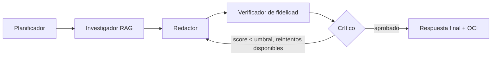

# NuevaMente 🎓 — Kairos G10

Sistema Inteligente de Adaptación y Generación de Contenido Educativo.
**Hackathon ONE G10** (Oracle Next Education & Alura) — Proyecto 1.
Equipo **Kairos G10** (G10-LATAM-equipo 41) · Nicho de foco: **Salud**.

> ⚕️ El contenido que genera esta aplicación es material de apoyo educativo
> basado en la documentación que el usuario proporciona. **No reemplaza el
> criterio de un profesional de salud ni las indicaciones oficiales vigentes.**

---

## 1. Qué hace

Recibe un documento técnico (PDF, Markdown o texto), lo indexa con RAG, y lo
transforma en contenido educativo personalizado según:

- **Perfil del destinatario:** Principiante, Desarrollador Junior/Semi Senior,
  Líder Técnico/Arquitecto, Gestor/Ejecutivo.
- **Formato pedagógico:** Flashcards, Quiz, Tutorial, Resumen Ejecutivo, Guion
  de Clase.
- **Nicho/sector:** General, Fintech, Salud, E-commerce.

Cada afirmación generada se **verifica contra el documento fuente** y se le
asigna un score de anclaje. Esto vale para los 5 formatos: en Resumen Ejecutivo
se verifica cada oración del resumen y en Guion de Clase cada escena. Si un
resultado no trae afirmaciones con fuente, no se aprueba y su score es 0. Todo se guarda en OCI Object Storage (o en un
respaldo local si OCI no está configurado) y se expone por API REST y por una
interfaz web (HTML/CSS/JS, servida por la misma API en `http://localhost:8000/`).

## 2. Arquitectura

```
Documento (PDF/MD/TXT)
        │
        ▼
   [Ingesta]  chunking con solapamiento + detección de secciones
        │
        ▼
[RAG local]  TF-IDF (scikit-learn) + vector store propio, aislado por doc_id
        │
        ▼
[Orquestación]  Planificador → Investigador (por sección) → Redactor →
                Verificador de fidelidad → Crítico (con reintento)
        │
        ▼
[Persistencia]  OCI Object Storage (o fallback local en data/fallback/)
        │
        ▼
  API REST (FastAPI)  ──►  Interfaz web (src/nuevamente/web/)
```

### Diagrama de flujo de agentes



## 3. Equipo de trabajo (Kairos G10)

| Persona | Rol |
|---|---|
| Juan Pablo Calla | Project Manager |
| Gaspar Martinez Paiva | Data Engineer |
| Bryan Infante | AI Engineer |
| Adrian Gil | ML Engineer |
| Ethan Espinoza Acosta | Backend Developer |
| Dario Higuera Moreno | No Code Developer |
| Diana Dure | QA Tester |

### Quién construyó qué

| Módulo | Responsable | Rol |
|---|---|---|
| `config.py`, arquitectura general, `docs/demo/` | Juan Pablo Calla | Project Manager |
| `ingest/`, `rag/` | Gaspar Martinez Paiva | Data Engineer |
| `agents/graph.py` | Bryan Infante | AI Engineer |
| `llm/`, `fidelity/` | Adrian Gil | ML Engineer |
| `schemas/`, `api/` | Ethan Espinoza Acosta | Backend Developer |
| `web/`, `ui/`, `exports/` | Dario Higuera Moreno | No Code Developer |
| `tests/` | Diana Dure | QA Tester |

## 4. Decisiones de diseño importantes (léelo antes de evaluar el código)

Este entorno de desarrollo **no tiene acceso de red a APIs externas** (Gemini,
OpenAI, Anthropic, ChromaDB Cloud, HuggingFace, OCI real). En vez de simular
resultados con datos inventados, el equipo tomó decisiones de arquitectura que
mantienen el pipeline **100% real y ejecutable**, con una interfaz clara para
conectar los servicios en la nube en la máquina del equipo:

| Pieza | En este entorno | En producción (con credenciales) |
|---|---|---|
| Embeddings | `LocalTfidfEmbeddings` (scikit-learn, sin red) | `GeminiEmbeddings` (por implementar) — mismo contrato `EmbeddingsProvider` |
| Vector store | Store propio en numpy, aislado por `doc_id` | ChromaDB — misma interfaz `buscar`/`buscar_por_seccion` |
| LLM generador | `TemplateLLM` (extractivo, determinista) | `GeminiLLMClient` (por implementar) — misma interfaz `LLMClient` |
| Juez de fidelidad | Similitud TF-IDF contra el chunk citado | LLM juez con cita textual |
| Orquestación | Función Python secuencial con reintento | Migrable a `StateGraph` de LangGraph sin cambiar las etapas |
| OCI Object Storage | Fallback a `data/fallback/` si no hay credenciales | Cliente real vía `oci` SDK (ya integrado, solo requiere `.env`) |

**Importante:** esto no es una simulación con datos falsos. El pipeline corre
de principio a fin sobre el documento real que se le da, indexa contenido
real, recupera evidencia real y verifica fidelidad real contra esa evidencia.
Lo que cambia entre este entorno y producción es *qué tan sofisticado* es el
componente de generación/embeddings, no si el flujo funciona.

## 5. Instalación y uso

```bash
# 1. Instalar el paquete y dependencias
pip install -e ".[dev,ui]"

# 2. Correr los tests (42 pruebas, deben pasar todas)
pytest tests/ -v

# 3. Levantar la API y la interfaz web (un solo proceso)
uvicorn nuevamente.api.app:app --reload
# Interfaz:                  http://localhost:8000/
# Documentación de la API:   http://localhost:8000/docs

# 4. (Opcional) la interfaz Streamlit anterior sigue disponible
streamlit run ui/app.py

# 5. Ejecutar los 3 escenarios de demo (Salud, B2B) y guardar evidencia
python scripts/run_demo.py
```

### Variables de entorno (`.env`, ver `.env.example`)

Copia `.env.example` a `.env`. Se carga al importar `nuevamente.config`: primero el
`.env` del directorio actual y luego el de la raíz del repo. Las variables ya
exportadas en la terminal tienen prioridad sobre las del archivo.

```env
LLM_PROVIDER=template            # cambiar a "gemini" cuando haya API key + red
EMBEDDINGS_PROVIDER=local
FIDELITY_MIN_GENERAL=0.85
FIDELITY_MIN_SALUD=0.90          # umbral reforzado para el nicho Salud
OCI_CONFIG_FILE=~/.oci/config
OCI_BUCKET=nuevamente-contenidos-educativos
```

Ver también `docs/SETUP_OCI.md` para crear la cuenta OCI Always Free, el
bucket privado y las claves API paso a paso.

## 6. Ejemplo de uso de la API

```bash
curl -X POST http://localhost:8000/api/v1/adaptar \
  -H "Content-Type: application/json" \
  -d '{
    "documento_titulo": "Protocolo de bioseguridad",
    "documento_contenido": "El lavado de manos con agua y jabón durante al menos 20 segundos elimina la mayoría de los microorganismos de las manos.",
    "perfil_destinatario": "Principiante",
    "formato_salida": "Flashcards",
    "nicho_sector": "Salud"
  }'
```

## 7. Los 3 escenarios de demo (Salud, casos de uso B2B)

Ejecutados por `scripts/run_demo.py` sobre `docs/demo/protocolo_bioseguridad_salud.md`
(documento original del equipo, de dominio general, sin datos de pacientes):

| # | Caso de uso empresarial | Perfil | Formato |
|---|---|---|---|
| 1 | Onboarding de personal clínico nuevo | Principiante | Flashcards |
| 2 | Capacitación regulatoria interna | Desarrollador Junior/Semi Senior | Quiz |
| 3 | Actualización de protocolos ante auditoría | Gestor/Ejecutivo | Resumen Ejecutivo |

Resultados (JSON, Markdown y CSV de Anki) en `docs/demo/resultados/`.

## 8. Checklist del enunciado — estado real

- [x] Ingesta funcional de PDF, Markdown y texto
- [x] RAG con chunking, embeddings y búsqueda vectorial (ver limitación de proveedor arriba)
- [x] Orquestación tipo agentes (Planificador → Investigador → Redactor → Crítico, con reintento)
- [x] Adapta el mismo contenido a los 4 perfiles y los 5 formatos (probado en `tests/test_api.py`)
- [x] Salida JSON estructurada, interfaz web propia + API REST operativa
- [x] Integración con OCI Object Storage, con fallback local documentado y visible
- [x] Verificación de fidelidad con score y afirmaciones no sustentadas
- [x] 3 ejemplos de ejecución reales, documentados como casos de uso B2B en Salud
- [x] Tests automatizados (42), incluida seguridad ante inyección de instrucciones
- [ ] Despliegue en OCI Compute (pendiente — diferencial opcional)
- [ ] Conectar `GeminiLLMClient` real en la máquina del equipo (con API key)

## 9. Estructura del repositorio

```
nuevamente/
├── src/nuevamente/
│   ├── config.py
│   ├── schemas/        # enums, request, response, formatos (Ethan)
│   ├── ingest/          # lectores + chunking (Gaspar)
│   ├── rag/             # embeddings + vector store (Gaspar)
│   ├── llm/              # LLMClient, TemplateLLM, fábrica (Adrian)
│   ├── agents/           # orquestación (Bryan)
│   ├── fidelity/         # verificación de fidelidad (Adrian)
│   ├── storage/          # cliente OCI + fallback (Ethan/Gaspar)
│   ├── exports/          # Markdown, CSV Anki (Dario)
│   ├── api/              # FastAPI (Ethan)
│   └── web/              # Interfaz web: index.html, styles.css, app.js (Dario)
├── ui/app.py              # Interfaz Streamlit anterior (opcional)
├── scripts/
│   ├── oci_bootstrap.py   # crea/verifica el bucket OCI
│   └── run_demo.py        # corre los 3 escenarios de Salud
├── tests/                  # 42 pruebas (Diana)
├── docs/
│   ├── SETUP_OCI.md
│   └── demo/
│       ├── protocolo_bioseguridad_salud.md
│       └── resultados/
├── pyproject.toml
├── .env.example
└── README.md
```

## 10. Seguridad y manejo responsable del nicho Salud

- El documento de demo es contenido original del equipo, de carácter general,
  **sin datos de pacientes** y sin indicaciones de dosificación de medicamentos.
- El umbral de fidelidad para Salud es más estricto (0.90) que el general (0.85).
- La interfaz muestra un aviso visible cuando el nicho seleccionado es Salud.
- La interfaz web inserta todo el texto del documento como texto, nunca como HTML,
  así que un documento con etiquetas o scripts no puede ejecutar código en el navegador.
- El contenido del documento se trata siempre como **datos**, nunca como
  instrucciones (ver `tests/test_security.py`).

## 11. Limitaciones conocidas del generador local (`TemplateLLM`)

- Es extractivo: no traduce, así que `idioma_salida` se acepta pero hoy no cambia la salida.
- Es determinista: ignora la retroalimentación del Crítico, por eso el flujo corta
  los reintentos cuando el resultado sale idéntico al intento anterior.
- En el Quiz, los distractores son oraciones reales de *otras* secciones del
  documento; la correcta es la que corresponde a la sección que nombra la pregunta.
